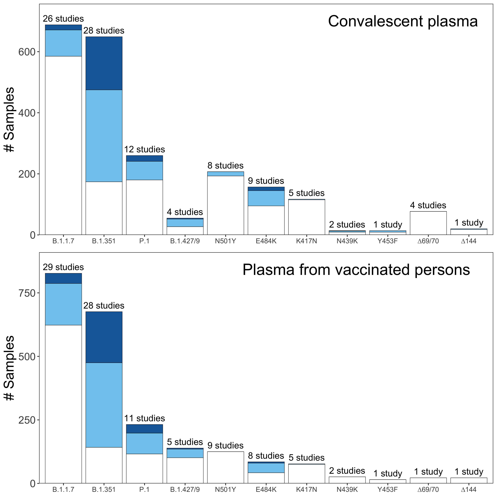

Report generated at: 05/07/2021 11:30 AM PDT


## CP Figure {.tabset}

### CP indiv muts


### CP indiv muts (violin)


### CP indiv muts (Jittery)


### CP indiv muts (Jittery, Boxplot)


### CP combo muts


### CP combo muts (Jittery)


### CP combo muts (violin)


### CP combo muts (Jittery, Boxplot)


## VP Figure {.tabset}

### VP indiv muts


### VP indiv muts (Jittery)


### VP indiv muts (Violin)


### VP indiv By vaccine type


### VP combo muts


### VP combo muts (Jittery)


### VP combo muts (Violin)


### VP combo By vaccine type


## Plasmas Figure {.tabset}

### CP and VP summary


## DMS  {.tabset}

### DMS vs fold


### DMS vs fold 3D
<!--html_preserve--><div id="htmlwidget-a34d2bc0ca4a655da5be" style="width:100%;height:480px;" class="plotly html-widget"></div>
<script type="application/json" data-for="htmlwidget-a34d2bc0ca4a655da5be">{"x":{"visdat":{"dc5942568b97":["function () ","plotlyVisDat"]},"cur_data":"dc5942568b97","attrs":{"dc5942568b97":{"x":{},"y":{},"z":{},"alpha_stroke":1,"sizes":[10,100],"spans":[1,20],"type":"scatter3d","mode":"markers","color":{},"inherit":true}},"layout":{"margin":{"b":40,"l":60,"t":25,"r":10},"scene":{"xaxis":{"type":"log","nticks":6,"title":"fold"},"yaxis":{"title":"score"},"zaxis":{"title":"position"}},"hovermode":"closest","showlegend":true},"source":"A","config":{"showSendToCloud":false},"data":[{"x":[3.8,4.7,5.7,3.5,3.7,3.2,4.4,6.4,4.7,7.4,6,5,3.2,9.9,9.9,3.4,4.4,4.9,3.1,7.3,6.1,3.6,8.1,3.3,4.8,6.5,5.6,4.9,5.5,3.9,3.1,4.5],"y":[0.002,0.002,0.002,0.004,0.017,0.011,0.098,0.003,0.002,0.002,0.003,0.002,0.003,0.051,0.075,0.007,0.008,0.061,0.032,0.008,0.082,0.098,0.03,0.002,0.002,0.011,0.005,0.002,0.002,0.002,0.002,0.013],"z":[444,445,450,453,485,484,484,444,445,452,444,445,484,456,456,456,484,439,501,484,476,484,484,444,444,456,493,445,445,445,446,490],"type":"scatter3d","mode":"markers","name":"partial-resistance","marker":{"color":"rgba(102,194,165,1)","line":{"color":"rgba(102,194,165,1)"}},"textfont":{"color":"rgba(102,194,165,1)"},"error_y":{"color":"rgba(102,194,165,1)"},"error_x":{"color":"rgba(102,194,165,1)"},"line":{"color":"rgba(102,194,165,1)"},"frame":null},{"x":[149.6,20.3,32.9,17,22,100,110.3,81,208.4,13.3,40.7,168.8,577.8,577.8,25.6,25.6,25.6,25.6,16.4,92,4800.5,1392.2,16,84.4,937,108.6,35.9,860.6,48.7,182.1,268.8,100,250,1000,1000,13.1,10.5,10.1,11.5,19,68.4,10.9,2737.7,2737.7,2202.2,2737.7,2737.7,2737.7,2737.7,2202.2,2737.7,26.9,1377,1548.8,2631.7,165.8,1548.8,2631.7,15.1,46.8,34.7,106.6,26.5,73.1,10.8,533.7,54.9,1873.8,125.7,1873.8,220.3,956.2,1873.8,213.5,1873.8,26.7,956.2,1873.8,45.4,100,100],"y":[0.564,0.008,0.002,0.002,0.001,0.534,0.205,0.497,0.427,0.36,0.165,0.228,0.297,0.29,0.564,0.574,0.943,0.633,0.959,0.952,0.995,0.985,0.611,0.328,0.988,0.153,0.061,0.97,0.003,0.574,0.97,0.815,0.966,1,0.97,0.003,0.008,0.002,0.002,0.002,0.293,0.002,0.916,0.558,1,0.48,0.984,0.311,0.919,0.522,0.522,0.002,0.82,0.813,0.813,0.01,0.815,0.815,0.004,0.004,0.002,0.073,0.001,0.211,0.002,0.16,0.802,0.979,0.952,0.973,0.817,0.966,0.991,0.967,0.996,0.72,0.981,0.981,0.905,1,0.966],"z":[417,484,450,484,484,493,378,417,420,487,484,490,486,487,417,453,486,493,446,406,417,460,475,406,486,406,439,444,417,453,486,440,484,484,484,417,484,445,446,455,455,483,484,484,484,484,490,490,493,493,493,494,346,346,346,439,440,440,444,444,444,444,445,445,445,446,455,455,456,484,484,484,484,490,493,493,493,493,494,484,484],"type":"scatter3d","mode":"markers","name":"resistant","marker":{"color":"rgba(252,141,98,1)","line":{"color":"rgba(252,141,98,1)"}},"textfont":{"color":"rgba(252,141,98,1)"},"error_y":{"color":"rgba(252,141,98,1)"},"error_x":{"color":"rgba(252,141,98,1)"},"line":{"color":"rgba(252,141,98,1)"},"frame":null},{"x":[1.3,1.8,1.9,1.4,2.7,1.1,1,1,1.4,1.6,1.4,0.8,1.2,0.8,2.8,1.1,1.7,0.6,0.9,1,1.2,1.1,0.7,0.5,1.2,0.2,1.1,0.5,1.2,0.9,1.1,1,1.7,0.5,1.2,1.8,1.9,1.6,1.5,2.7,1.1,1.1,2,2,1,1,1,1,1,1,1,1,1,1,1,1,1,1,1,1,1,1,1,1,1,0.5,1.2,0.1,0.6,1.5,1.8,2.5,0.4,1,0.9,0.8,1.1,0.2,2,1.1,1.6,1,0.7,1.5,1.6,1,0.9,1.7,1.9,1.5,0.5,0.4,1.6,1.3,1.5,0.5,0.4,0.9,1.2,0.5,0.7,0.9,1,0.8,1.7,0.9,1.5,1.2,1.6,1.1,1.5,1.3,1.5,1.2,1.7,2.5,1,0.5,0.3,0.4,1.4,0.5,1,1.5,0.8,1.5,1.5,0.8,0.3,1,1.4,0.7,0.8,0.7,0.3,0.4,0.8,0.6,1.4,1.3,0.4,1.7,0.1,1,1.4,1.2,1.1,0.8,0.6,0.4,0.8,0.8,1.4,0.8,0.5,2.3,2.1,1.7,1.6,1.3,1,1.6,0.9,0.6,1.2,1,1.2,1.5,1.6,0.7,0.8,0.9,0.7,1.2,1.4,0.5,0.8,1.5,0.6,1.1,2.1,1.7,0.8,0.9,0.3,0.5,0.3,1,0.7,2.1,1,1.3,1.1,1.8,1,1.2,1.4,2,1.2,1.4,1.9,1.3,1.4,0.8,2.2,1.4,0.8,0.5,0.7,0.6,0.9,1.2,0.8,1.5,0.7,0.8,0.9,2,1.1,0.8,2,0.9,1.2,1.2,1.1,0.9,1.1,0.8,1.2,1.4,0.9,0.9,1.2,0.8,0.8,0.8,1.4,1.1,2],"y":[0.003,0.002,0.001,0.001,0.002,0.001,0.002,0.002,0.003,0.007,0.001,0.008,0.002,0.002,0.002,0.002,0.002,0.002,0.002,0.002,0.002,0.002,0.001,0.002,0.002,0.035,0.033,0.025,0.027,0.001,0.002,0.001,0.003,0.015,0.002,0.002,0.001,0.001,0.003,0.002,0.001,0.001,0.001,0.03,0.002,0.001,0.002,0.001,0.001,0.003,0.002,0.002,0.002,0.001,0.002,0.004,0.015,0.002,0.002,0.001,0.002,0.003,0.001,0.001,0.002,0.002,0.002,0.001,0.001,0.003,0.002,0.002,0.001,0.001,0.002,0.002,0.003,0.002,0.002,0.002,0.002,0.002,0.002,0.002,0.002,0.002,0.001,0.004,0.002,0.002,0.003,0.002,0.003,0.002,0.002,0.002,0.002,0.002,0.037,0.036,0.037,0.032,0.032,0.036,0.037,0.037,0.035,0.034,0.037,0.037,0.037,0.044,0.037,0.038,0.038,0.052,0.041,0.037,0.004,0.002,0.003,0.001,0.001,0.002,0.002,0.002,0.001,0.001,0.002,0.004,0.011,0.002,0.002,0.002,0.004,0.002,0.003,0.001,0.001,0.003,0.012,0.018,0.002,0.002,0.003,0.002,0.002,0.002,0.044,0.034,0.032,0.002,0.002,0.002,0.001,0.002,0.002,0.002,0.002,0.002,0.002,0.002,0.002,0.002,0.002,0.002,0.002,0.002,0.002,0.002,0.002,0.002,0.002,0.002,0.002,0.002,0.002,0.002,0.001,0.001,0.001,0.002,0.003,0.002,0.003,0.002,0.002,0.001,0.001,0.002,0.002,0.001,0.002,0.002,0.002,0.002,0.002,0.001,0.003,0.002,0.002,0.002,0.002,0.001,0.003,0.002,0.002,0.001,0.001,0.001,0.002,0.001,0.001,0.001,0.001,0.001,0.001,0.001,0.001,0.001,0.002,0.001,0.001,0.001,0.001,0.001,0.001,0.001,0.001,0.002,0.001,0.002,0.001,0.001,0.001,0.001,0.002,0.002,0.001],"z":[417,455,484,485,486,490,490,493,444,445,450,490,490,417,453,455,484,485,486,490,490,493,417,417,501,417,501,417,501,417,484,501,384,446,452,455,477,484,486,486,494,501,484,484,417,460,460,460,483,484,490,494,501,501,409,439,446,452,476,484,484,493,494,501,392,475,486,487,490,456,456,456,446,478,479,490,501,417,453,478,479,484,486,490,493,501,439,439,444,486,444,486,501,417,453,484,486,501,346,367,417,439,439,440,444,445,446,449,453,455,477,479,483,483,484,485,490,494,417,484,501,417,440,501,417,440,484,501,417,440,484,501,417,501,417,484,501,417,484,501,417,501,417,501,501,417,484,501,417,484,501,346,346,346,367,439,440,440,444,444,444,445,445,445,445,445,445,446,455,475,475,476,476,478,483,483,501,503,367,444,445,455,455,455,456,475,475,476,476,478,483,483,483,484,484,484,484,490,490,493,493,493,493,494,501,503,346,346,346,367,439,440,440,444,444,444,444,444,445,445,445,445,445,445,445,446,446,455,475,475,476,476,478,483,483,483,501,503,484],"type":"scatter3d","mode":"markers","name":"susceptible","marker":{"color":"rgba(141,160,203,1)","line":{"color":"rgba(141,160,203,1)"}},"textfont":{"color":"rgba(141,160,203,1)"},"error_y":{"color":"rgba(141,160,203,1)"},"error_x":{"color":"rgba(141,160,203,1)"},"line":{"color":"rgba(141,160,203,1)"},"frame":null}],"highlight":{"on":"plotly_click","persistent":false,"dynamic":false,"selectize":false,"opacityDim":0.2,"selected":{"opacity":1},"debounce":0},"shinyEvents":["plotly_hover","plotly_click","plotly_selected","plotly_relayout","plotly_brushed","plotly_brushing","plotly_clickannotation","plotly_doubleclick","plotly_deselect","plotly_afterplot","plotly_sunburstclick"],"base_url":"https://plot.ly"},"evals":[],"jsHooks":[]}</script><!--/html_preserve-->

### DMS vs fold by mab


## DMS Statistic Test  {.tabset}

### All

```
## Warning in chisq.test(tbl): Chi-squared approximation may be incorrect
```

```
## 
## 	Pearson's Chi-squared test
## 
## data:  tbl
## X-squared = 15733, df = 8690, p-value < 2.2e-16
```

```
## 
## 	Spearman's rank correlation rho
## 
## data:  df$fold and df$score
## S = 3106546, p-value < 2.2e-16
## alternative hypothesis: true rho is not equal to 0
## sample estimates:
##       rho 
## 0.5726296
```

### Fold >= 10 and score >= 0.1

```
## Warning in chisq.test(tbl): Chi-squared approximation may be incorrect
```

```
## 
## 	Pearson's Chi-squared test
## 
## data:  tbl
## X-squared = 1834.8, df = 1748, p-value = 0.07276
```

```
## 
## 	Spearman's rank correlation rho
## 
## data:  df_Fold_gt10$fold and df_Fold_gt10$score
## S = 25237, p-value = 0.008798
## alternative hypothesis: true rho is not equal to 0
## sample estimates:
##       rho 
## 0.3326979
```

### Fold >= 10

```
## Warning in chisq.test(tbl): Chi-squared approximation may be incorrect
```

```
## 
## 	Pearson's Chi-squared test
## 
## data:  tbl
## X-squared = 3084.4, df = 3132, p-value = 0.7246
```

```
## 
## 	Spearman's rank correlation rho
## 
## data:  df_Fold_gt10$fold and df_Fold_gt10$score
## S = 33432, p-value = 5.498e-10
## alternative hypothesis: true rho is not equal to 0
## sample estimates:
##       rho 
## 0.6224954
```

### Fold < 10

```
## Warning in chisq.test(tbl): Chi-squared approximation may be incorrect
```

```
## 
## 	Pearson's Chi-squared test
## 
## data:  tbl
## X-squared = 2952.6, df = 1530, p-value < 2.2e-16
```

```
## 
## 	Spearman's rank correlation rho
## 
## data:  df_Fold_lt10$fold and df_Fold_lt10$score
## S = 2584307, p-value = 0.0002473
## alternative hypothesis: true rho is not equal to 0
## sample estimates:
##       rho 
## 0.2208996
```


### Fold >10 and score < 0.1

```
## Warning in chisq.test(tbl): Chi-squared approximation may be incorrect
```

```
## 
## 	Pearson's Chi-squared test
## 
## data:  tbl
## X-squared = 140, df = 133, p-value = 0.3218
```

```
## 
## 	Spearman's rank correlation rho
## 
## data:  df_Score_outlier$fold and df_Score_outlier$score
## S = 860.58, p-value = 0.1269
## alternative hypothesis: true rho is not equal to 0
## sample estimates:
##       rho 
## 0.3529458
```


### Mab, Score

```
## Warning in chisq.test(tbl): Chi-squared approximation may be incorrect
```

```
## 
## 	Pearson's Chi-squared test
## 
## data:  tbl
## X-squared = 3001.1, df = 1580, p-value < 2.2e-16
```

## Variant summary {.tabset}

### Indiv summary (without distinguish study type)


### Indiv summary (distinguish by study type)


### Domain summary


### Variant summary (distinguish by study type)

