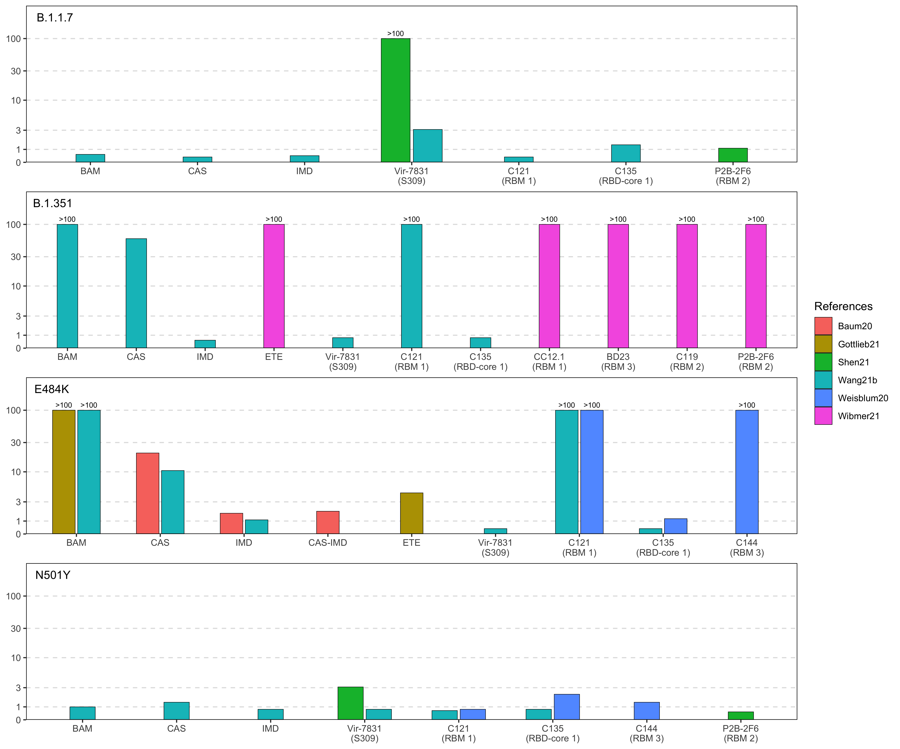

Report generated at: 02/02/2021 12:51 PM PDT

## Convalescent and immune plasma

fold ↓ susceptibility > 10&nbsp;
fold ↓ susceptibility 3 to 10&nbsp;
fold ↓ susceptibility < 3

## Monoclonal antibodies

