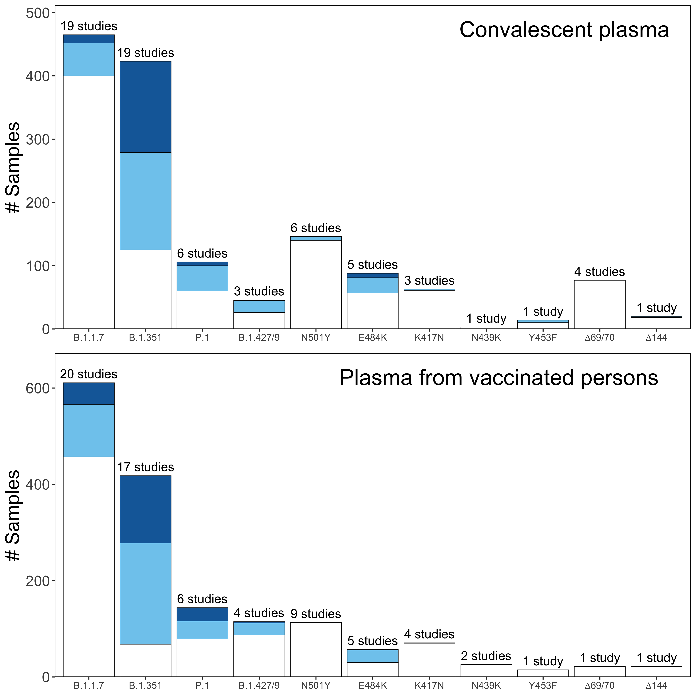

Report generated at: 04/08/2021 11:27 AM PDT

## Database summary

<table class=" lightable-minimal" style='font-family: "Trebuchet MS", verdana, sans-serif; width: auto !important; margin-left: auto; margin-right: auto;'>
 <thead>
  <tr>
   <th style="text-align:left;"> Variant.name </th>
   <th style="text-align:right;"> CP </th>
   <th style="text-align:right;"> IP </th>
   <th style="text-align:right;"> mAbs.phase3 </th>
   <th style="text-align:right;"> mAbs.structure </th>
  </tr>
 </thead>
<tbody>
  <tr>
   <td style="text-align:left;"> N501Y </td>
   <td style="text-align:right;"> 148 </td>
   <td style="text-align:right;"> 116 </td>
   <td style="text-align:right;"> 51 </td>
   <td style="text-align:right;"> 17 </td>
  </tr>
  <tr>
   <td style="text-align:left;"> E484K </td>
   <td style="text-align:right;"> 88 </td>
   <td style="text-align:right;"> 57 </td>
   <td style="text-align:right;"> 58 </td>
   <td style="text-align:right;"> 16 </td>
  </tr>
  <tr>
   <td style="text-align:left;"> K417N </td>
   <td style="text-align:right;"> 63 </td>
   <td style="text-align:right;"> 71 </td>
   <td style="text-align:right;"> 38 </td>
   <td style="text-align:right;"> 14 </td>
  </tr>
  <tr>
   <td style="text-align:left;"> K417T </td>
   <td style="text-align:right;"> 24 </td>
   <td style="text-align:right;"> 0 </td>
   <td style="text-align:right;"> 3 </td>
   <td style="text-align:right;"> 3 </td>
  </tr>
  <tr>
   <td style="text-align:left;"> L452R </td>
   <td style="text-align:right;"> 2 </td>
   <td style="text-align:right;"> 0 </td>
   <td style="text-align:right;"> 14 </td>
   <td style="text-align:right;"> 5 </td>
  </tr>
  <tr>
   <td style="text-align:left;"> Other individual mutations </td>
   <td style="text-align:right;"> 553 </td>
   <td style="text-align:right;"> 446 </td>
   <td style="text-align:right;"> 593 </td>
   <td style="text-align:right;"> 462 </td>
  </tr>
  <tr>
   <td style="text-align:left;"> All individual mutations </td>
   <td style="text-align:right;"> 878 </td>
   <td style="text-align:right;"> 682 </td>
   <td style="text-align:right;"> 744 </td>
   <td style="text-align:right;"> 515 </td>
  </tr>
  <tr>
   <td style="text-align:left;"> B.1.1.7 </td>
   <td style="text-align:right;"> 475 </td>
   <td style="text-align:right;"> 611 </td>
   <td style="text-align:right;"> 67 </td>
   <td style="text-align:right;"> 26 </td>
  </tr>
  <tr>
   <td style="text-align:left;"> B.1.351 </td>
   <td style="text-align:right;"> 423 </td>
   <td style="text-align:right;"> 418 </td>
   <td style="text-align:right;"> 61 </td>
   <td style="text-align:right;"> 15 </td>
  </tr>
  <tr>
   <td style="text-align:left;"> P.1 </td>
   <td style="text-align:right;"> 106 </td>
   <td style="text-align:right;"> 144 </td>
   <td style="text-align:right;"> 25 </td>
   <td style="text-align:right;"> 3 </td>
  </tr>
  <tr>
   <td style="text-align:left;"> B.1.427/9 </td>
   <td style="text-align:right;"> 46 </td>
   <td style="text-align:right;"> 115 </td>
   <td style="text-align:right;"> 9 </td>
   <td style="text-align:right;"> 3 </td>
  </tr>
  <tr>
   <td style="text-align:left;"> B.1.526 </td>
   <td style="text-align:right;"> 0 </td>
   <td style="text-align:right;"> 0 </td>
   <td style="text-align:right;"> 3 </td>
   <td style="text-align:right;"> 0 </td>
  </tr>
  <tr>
   <td style="text-align:left;"> Other combinations of mutations </td>
   <td style="text-align:right;"> 581 </td>
   <td style="text-align:right;"> 651 </td>
   <td style="text-align:right;"> 164 </td>
   <td style="text-align:right;"> 155 </td>
  </tr>
  <tr>
   <td style="text-align:left;"> All combinations of mutations </td>
   <td style="text-align:right;"> 1631 </td>
   <td style="text-align:right;"> 1947 </td>
   <td style="text-align:right;"> 338 </td>
   <td style="text-align:right;"> 204 </td>
  </tr>
</tbody>
</table>

## CP and VP summary

