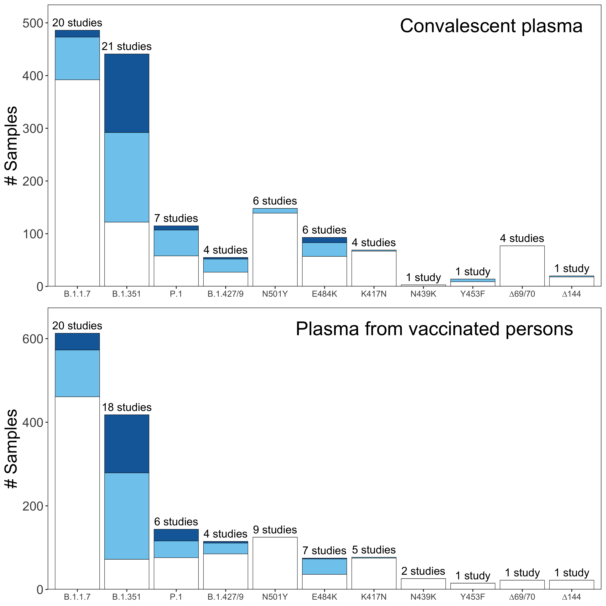

Report generated at: 04/12/2021 10:59 AM PDT

## Variant {.tabset}

### Individual mutation
<!--html_preserve-->

<!--/html_preserve-->

### Multiple mutation or variant
<!--html_preserve-->

<!--/html_preserve-->

### Variant vs Mab
<!--html_preserve-->

<script type="application/json" data-for="htmlwidget-f7d93e443f35ca51a381">{"x":{"filter":"none","extensions":["Buttons"],"data":[["20A.EU2","20A.EU2","20A.EU2","20A.EU2","20A.EU2","20A.EU2","20A.EU2","20A.EU2","20A.EU2","20A.EU2","20A.EU2","20A.EU2","20A.EU2","20A.EU2","20A.EU2","20A.EU2","20A.EU2","20A.EU2","20A.EU2","20A.EU2","20A.EU2","20A.EU2","20A.EU2","20A.EU2","20A.EU2","20A.EU2","20A.EU2","20A.EU2","20A.EU2","20A.EU2","20A.EU2","B.1.1.7","B.1.1.7","B.1.1.7","B.1.1.7","B.1.1.7","B.1.1.7","B.1.1.7","B.1.1.7","B.1.1.7","B.1.1.7","B.1.1.7","B.1.1.7","B.1.1.7","B.1.1.7","B.1.1.7","B.1.1.7","B.1.1.7","B.1.1.7","B.1.1.7","B.1.1.7","B.1.1.7","B.1.1.7","B.1.1.7","B.1.1.7","B.1.1.7","B.1.1.7","B.1.1.7","B.1.1.7","B.1.1.7","B.1.1.7","B.1.1.7","B.1.1.7","B.1.1.7","B.1.1.7","B.1.1.7","B.1.1.7","B.1.1.7","B.1.1.7","B.1.1.7","B.1.1.7","B.1.1.7","B.1.1.7","B.1.1.7","B.1.1.7","B.1.1.7","B.1.1.7","B.1.1.7","B.1.1.7","B.1.1.7","B.1.1.7","B.1.1.7","B.1.1.7","B.1.1.7","B.1.1.7","B.1.1.7","B.1.1.7","B.1.1.7","B.1.1.7","B.1.1.7","B.1.1.7","B.1.1.7","B.1.1.7","B.1.1.7","B.1.1.7","B.1.1.7","B.1.1.7","B.1.1.7","B.1.1.7","B.1.1.7","B.1.1.7","B.1.1.7","B.1.1.7","B.1.1.7","B.1.1.7","B.1.1.7","B.1.1.7","B.1.1.7","B.1.1.7","B.1.1.7","B.1.1.7","B.1.1.7","B.1.1.7","B.1.1.7","B.1.1.7","B.1.1.7","B.1.1.7","B.1.1.7","B.1.1.7","B.1.1.7","B.1.1.7","B.1.1.7","B.1.1.7","B.1.1.7","B.1.1.7","B.1.1.7","B.1.1.7","B.1.1.7","B.1.1.7","B.1.1.7","B.1.1.7","B.1.1.7","B.1.1.7","B.1.1.7","B.1.1.7","B.1.1.7","B.1.1.7","B.1.1.7","B.1.1.7","B.1.1.7","B.1.1.7","B.1.1.7","B.1.1.7","B.1.1.7","B.1.1.7","B.1.1.7","B.1.1.7","B.1.1.7","B.1.1.7","B.1.1.7","B.1.1.7","B.1.1.7","B.1.1.7","B.1.1.7","B.1.1.7","B.1.1.7","B.1.1.7","B.1.1.7","B.1.1.7","B.1.1.7","B.1.1.7","B.1.1.7","B.1.1.7","B.1.1.7","B.1.1.7","B.1.1.7","B.1.1.7","B.1.1.7","B.1.1.7","B.1.1.7","B.1.1.7","B.1.1.7","B.1.1.7","B.1.1.7","B.1.1.7","B.1.1.7","B.1.1.7","B.1.1.7","B.1.1.7","B.1.1.7 S1","B.1.351","B.1.351","B.1.351","B.1.351","B.1.351","B.1.351","B.1.351","B.1.351","B.1.351","B.1.351","B.1.351","B.1.351","B.1.351","B.1.351","B.1.351","B.1.351","B.1.351","B.1.351","B.1.351","B.1.351","B.1.351","B.1.351","B.1.351","B.1.351","B.1.351","B.1.351","B.1.351","B.1.351","B.1.351","B.1.351","B.1.351","B.1.351","B.1.351","B.1.351","B.1.351","B.1.351","B.1.351","B.1.351","B.1.351","B.1.351","B.1.351","B.1.351","B.1.351","B.1.351","B.1.351","B.1.351","B.1.351","B.1.351","B.1.351","B.1.351","B.1.351","B.1.351","B.1.351","B.1.351","B.1.351","B.1.351","B.1.351","B.1.351","B.1.351","B.1.351","B.1.351","B.1.351","B.1.351","B.1.351","B.1.351","B.1.351","B.1.351","B.1.351","B.1.351","B.1.351","B.1.351","B.1.351","B.1.351","B.1.351","B.1.351 :-18F-242del-243del-244del-246I","B.1.351 :-18F-242del-243del-244del-246I","B.1.351 :-18F-242del-243del-244del-246I","B.1.351 :-18F-244del-246I","B.1.351 :-18F-244del-246I","B.1.351 :-18F-244del-246I","B.1.351 :-246I","B.1.351 :-246I","B.1.351 :-246I","B.1.351 :-246I","B.1.351 :-246I","B.1.351 :-246I","B.1.351 :-246I","B.1.351 :-246I","B.1.351 :-246I","B.1.351 RBD","B.1.351 RBD","B.1.351 RBD","B.1.351 RBD","B.1.351 RBD","B.1.351 RBD","B.1.351 RBD","B.1.351 RBD","B.1.351 RBD","B.1.351 RBD","B.1.351 RBD","B.1.351 RBD","B.1.351 RBD","B.1.351 RBD","B.1.351 RBD","B.1.351 RBD","B.1.351 RBD","B.1.351 RBD","B.1.351 RBD","B.1.351 RBD","B.1.351 RBD","B.1.351 RBD","B.1.351 RBD","B.1.351 RBD","B.1.351 RBD","B.1.351 RBD","B.1.351 RBD","B.1.351 RBD","B.1.351 RBD","B.1.351 RBD","B.1.351 RBD","B.1.351 RBD","B.1.351 RBD","B.1.351 RBD","B.1.351 RBD","B.1.351 RBD","B.1.351 RBD","B.1.351 RBD","B.1.351 RBD","B.1.351 RBD","B.1.351 RBD","B.1.351 RBD","B.1.351 RBD","B.1.351 RBD","B.1.351 RBD","B.1.351 RBD","B.1.351 RBD","B.1.351 RBD","B.1.351 RBD","B.1.351 RBD","B.1.351 RBD","B.1.351 RBD","B.1.351 RBD","B.1.351 RBD","B.1.351 RBD","B.1.351 RBD","B.1.351 RBD","B.1.351 RBD","B.1.351 RBD","B.1.351 RBD","B.1.351 RBD","B.1.351 RBD","B.1.351 RBD","B.1.351 RBD","B.1.351 RBD","B.1.351 RBD","B.1.351 RBD","B.1.351 RBD","B.1.351 RBD","B.1.351 RBD","B.1.351 RBD","B.1.351 RBD","B.1.351 RBD","B.1.351 RBD","B.1.351 RBD","B.1.351 RBD","B.1.351 RBD","B.1.351 RBD","B.1.351 RBD","B.1.351 RBD","B.1.351 RBD","B.1.351 RBD","B.1.351 RBD","B.1.351 RBD","B.1.351 RBD","B.1.351 RBD","B.1.351 RBD","B.1.351 RBD","B.1.351 RBD","B.1.351 RBD","B.1.351 RBD","B.1.351 RBD","B.1.351 RBD","B.1.429","B.1.429","B.1.429","B.1.429","B.1.429","B.1.429","B.1.429","B.1.429","B.1.429","B.1.429","B.1.429","B.1.429","B.1.429","B.1.429","B.1.429","B.1.429","B.1.429","B.1.429","B.1.429","B.1.429","B.1.429","B.1.429","B.1.429","B.1.429","B.1.429","B.1.429","B.1.429","B.1.429","B.1.429","B.1.429","B.1.429","B.1.429","B.1.429","B.1.429","B.1.429","B.1.429","B.1.526","B.1.526","B.1.526","COH.20G/677H","COH.20G/677H","Mink Cluster 5","Mink Cluster 5","P.1","P.1","P.1","P.1","P.1","P.1","P.1","P.1","P.1","P.1","P.1","P.1","P.1","P.1","P.1","P.1","P.1","P.1","P.1","P.1","P.1","P.1","P.1","P.1","P.1","P.1","P.1","P.1","P.1","PT188_EM","PT188_EM","PT188_EM","PT188_EM","S:1098Q","S:1098Q","S:1098Q","S:1098Q","S:1098Q","S:1098Q","S:1098Q","S:1098Q","S:1098Q","S:1098Q","S:1098Q","S:1098Q","S:1098Q","S:1118H","S:1118H","S:1118H","S:1118H","S:1118H","S:1118H","S:1118H","S:1118H","S:1118H","S:1118H","S:1118H","S:1118H","S:1118H","S:1118H","S:1118H","S:1118H","S:1118H","S:1118H","S:1118H","S:1118H","S:1118H","S:1118H","S:1118H","S:1118H","S:1118H","S:1118H","S:1118H","S:1118H","S:1118H","S:1118H","S:1118H","S:1118H","S:1118H","S:1118H","S:1118H","S:1118H","S:1118H","S:1118H","S:1118H","S:1118H","S:1118H","S:1124V","S:1124V","S:1124V","S:1124V","S:1124V","S:1124V","S:1124V","S:1124V","S:1124V","S:1124V","S:1124V","S:1124V","S:1124V","S:1128F","S:1128F","S:1134Q","S:1134Q","S:1134Q","S:1134Q","S:1134Q","S:1134Q","S:1134Q","S:1134Q","S:1134Q","S:1134Q","S:1134Q","S:1134Q","S:1134Q","S:1147L","S:1147L","S:1158Q","S:1158Q","S:1158Q","S:1158Q","S:1158Q","S:1158Q","S:1158Q","S:1158Q","S:1158Q","S:1158Q","S:1158Q","S:1158Q","S:1158Q","S:1163Y","S:1163Y","S:1163Y","S:1163Y","S:1163Y","S:1163Y","S:1163Y","S:1163Y","S:1163Y","S:1163Y","S:1163Y","S:1163Y","S:1173Q","S:1173Q","S:1173Q","S:1173Q","S:1173Q","S:1173Q","S:1173Q","S:1173Q","S:1173Q","S:1173Q","S:1173Q","S:1173Q","S:1173Q","S:1194Q","S:1194Q","S:1194Q","S:1194Q","S:1194Q","S:1194Q","S:1194Q","S:1194Q","S:1194Q","S:1194Q","S:1194Q","S:1194Q","S:1194Q","S:1229I","S:1229I","S:1229I","S:1229I","S:1229I","S:1229I","S:1229I","S:1229I","S:1229I","S:1229I","S:1229I","S:1229I","S:1229I","S:1229I","S:1229I","S:1237I","S:1237I","S:1237I","S:1237I","S:1237I","S:1237I","S:1237I","S:1237I","S:1237I","S:1237I","S:1237I","S:1237I","S:1237I","S:1263L","S:1263L","S:1263L","S:1263L","S:1263L","S:1263L","S:1263L","S:1263L","S:1263L","S:1263L","S:1263L","S:1263L","S:1263L","S:12P","S:12P","S:12P","S:12P","S:12P","S:136Y","S:136Y","S:136Y","S:136Y","S:136Y","S:138Y","S:138Y","S:138Y","S:138Y","S:144del","S:144del","S:144del","S:144del","S:144del","S:144del","S:144del","S:144del","S:144del","S:144del","S:144del","S:144del","S:144del","S:144del","S:144del","S:144del","S:144del","S:144del","S:144del","S:144del","S:144del","S:144del","S:144del","S:144del","S:144del","S:144del","S:144del","S:144del","S:144del","S:144del","S:144del","S:144del","S:144del","S:144del","S:144del","S:144del","S:144del","S:144del","S:144del","S:144del","S:144del","S:144del","S:144del","S:144del","S:145del","S:145del","S:145del","S:145del","S:145del","S:145del","S:145del","S:145del","S:145del","S:145del","S:145del","S:145del","S:145del","S:145del+408I","S:145del+408I","S:145del+408I","S:145del+408I","S:145del+408I","S:145del+408I","S:145del+408I","S:145del+408I","S:145del+408I","S:145del+408I","S:145del+408I","S:145del+408I","S:145del+408I","S:146Y","S:146Y","S:146Y","S:147T","S:147T","S:147T","S:147T","S:149H","S:149H","S:149H","S:149H","S:149H","S:149H","S:149H","S:149H","S:149H","S:149H","S:149H","S:149H","S:149H","S:149Q","S:149Q","S:149Q","S:149Q","S:149Q","S:149Q","S:149Q","S:149Q","S:149Q","S:149Q","S:149Q","S:149Q","S:149Q","S:149Q","S:165Q","S:165Q","S:165Q","S:165Q","S:165Q","S:165Q","S:165Q","S:165Q","S:165Q","S:165Q","S:165Q","S:165Q","S:165Q","S:17Q","S:17Q","S:17Q","S:17Q","S:17Q","S:17Q","S:17Q","S:17Q","S:17Q","S:17Q","S:17Q","S:17Q","S:17Q","S:18F","S:18F","S:18F","S:18F","S:18F","S:18F","S:18F","S:18F","S:18F","S:18F","S:18F","S:18F","S:18F","S:18F","S:18F","S:18F","S:18F","S:18F","S:18F","S:18F","S:18F","S:18F","S:18F","S:18F","S:18F","S:18F","S:18F","S:18F","S:18F","S:18F","S:18F","S:18F","S:18F","S:18F","S:18F","S:18F","S:18F","S:18F","S:18F","S:18F","S:18F","S:18F","S:18F","S:190S","S:190S","S:190S","S:190S","S:190S","S:190S","S:19A","S:19A","S:19A","S:19A","S:20N","S:20N","S:20N","S:20N","S:20N","S:20N","S:215G","S:215G","S:215G","S:215G","S:215G","S:215G","S:215G","S:215G","S:215G","S:215G","S:215G","S:215G","S:215G","S:215G","S:215G","S:215G","S:215G","S:215G","S:215G","S:215G","S:215G","S:215G","S:215G","S:215G","S:215G","S:215G","S:215G","S:215G","S:215G","S:215G","S:222V","S:222V","S:222V","S:222V","S:222V","S:222V","S:222V","S:222V","S:222V","S:222V","S:222V","S:222V","S:222V","S:222V","S:222V","S:222V","S:222V","S:222V","S:222V","S:222V","S:234Q","S:234Q","S:234Q","S:234Q","S:234Q","S:234Q","S:234Q","S:234Q","S:234Q","S:234Q","S:234Q","S:234Q","S:234Q","S:239K","S:239K","S:239K","S:239K","S:239K","S:239K","S:239K","S:239K","S:239K","S:239K","S:239K","S:239K","S:239K","S:242del+243del+244del","S:242del+243del+244del","S:242del+243del+244del","S:242del+243del+244del","S:242del+243del+244del","S:242del+243del+244del","S:242del+243del+244del","S:242del+243del+244del","S:242del+243del+244del","S:242del+243del+244del","S:242del+243del+244del","S:242del+243del+244del","S:242del+243del+244del","S:242del+243del+244del","S:242del+243del+244del","S:242del+243del+244del","S:242del+243del+244del","S:242del+243del+244del","S:242del+243del+244del","S:242del+243del+244del","S:242del+243del+244del","S:242del+243del+244del","S:242del+243del+244del","S:242del+243del+244del","S:242del+243del+244del","S:242del+243del+244del","S:242del+243del+244del","S:242del+243del+244del","S:242del+243del+244del","S:242del+243del+244del","S:242del+243del+244del","S:242del+243del+244del","S:242del+243del+244del","S:242del+243del+244del","S:242del+243del+244del","S:242del+243del+244del","S:242del+243del+244del","S:242del+243del+244del","S:242del+243del+244del","S:242del+243del+244del","S:242del+243del+244del","S:246A","S:246A","S:246A","S:246A","S:246I","S:246I","S:246I","S:246I","S:246I","S:246I","S:246I","S:246I","S:246I","S:246I","S:246I","S:246I","S:246I","S:246I","S:246I","S:246I","S:246I","S:246I","S:246I","S:246I","S:246I","S:246I","S:246I","S:246I","S:246I","S:246I","S:246I","S:246I","S:246I","S:246I","S:253G","S:253Y","S:261D+453F","S:26S","S:26S","S:26S","S:26S","S:26S","S:26S","S:282Q","S:282Q","S:282Q","S:282Q","S:282Q","S:282Q","S:282Q","S:282Q","S:282Q","S:282Q","S:282Q","S:282Q","S:282Q","S:321L","S:321L","S:321L","S:321L","S:321L","S:321L","S:321L","S:321L","S:321L","S:321L","S:321L","S:321L","S:321L","S:324G+325D","S:324G+325D","S:324G+325D","S:324G+325D","S:324G+325D","S:324G+325D","S:324G+325D","S:324G+325D","S:331Q","S:331Q","S:331Q","S:331Q","S:331Q","S:331Q","S:331Q","S:331Q","S:331Q","S:331Q","S:331Q","S:331Q","S:331Q","S:334K","S:335F","S:337H","S:337L","S:337R","S:337S","S:337T","S:338L","S:338L","S:338L","S:338L","S:338L","S:338L","S:338L","S:338L","S:338L","S:338L","S:338L","S:338L","S:338L","S:339D","S:340A","S:340A","S:340G","S:340K","S:341I","S:341I","S:341I","S:341I","S:341I","S:341I","S:341I","S:341I","S:341I","S:341I","S:341I","S:341I","S:341I","S:341I","S:344S","S:345A","S:345A","S:345A","S:345A","S:345A","S:345A","S:345A","S:345A","S:345A","S:345A","S:345A+517R","S:345A+517R","S:345A+517R","S:345A+517R","S:345A+517R","S:345A+517R","S:345A+517R","S:345A+517R","S:345A+517R","S:345A+517R","S:345N","S:345N","S:345N","S:345N","S:345N","S:345N","S:345N","S:345N","S:345N","S:345N","S:345S","S:345S","S:345S","S:345S","S:345S","S:345S","S:345S","S:345S","S:345S","S:345S","S:346G","S:346G","S:346G","S:346G","S:346G","S:346G","S:346G","S:346G","S:346G","S:346G","S:346K","S:346K","S:346K","S:346K","S:346K","S:346K","S:346S","S:346S","S:346S","S:346S","S:346S","S:346S","S:346S","S:346S","S:346S","S:346S","S:346S","S:346S","S:346S","S:346S","S:346S","S:346S","S:346S","S:346S","S:346S","S:346S","S:348T","S:348T","S:348T","S:348T","S:348T","S:348T","S:348T","S:348T","S:348T","S:348T","S:348T","S:348T","S:348T","S:352D","S:352D","S:352D","S:352D","S:352D","S:352D","S:352D","S:352D","S:352D","S:352D","S:354D","S:354D","S:354D","S:354D","S:354D","S:354D","S:354D","S:354D","S:354D","S:354D","S:354D","S:354D","S:354D","S:354D","S:354D","S:354D+364Y","S:354K","S:354K","S:354K","S:354K","S:354K","S:354K","S:354K","S:354K","S:354K","S:354K","S:354K","S:354K","S:354K","S:354K+95I","S:354S","S:359N","S:359N","S:359N","S:359N","S:359N","S:359N","S:359N","S:359N","S:359N","S:359N","S:359N","S:359N","S:359N","S:359N","S:367F","S:367F","S:367F","S:367F","S:367F","S:367F","S:367F","S:367F","S:367F","S:367F","S:367F","S:367F","S:367F","S:367F","S:367F","S:367F","S:367F","S:367F","S:367F","S:373F","S:373F","S:373F","S:373F","S:373F","S:373F","S:373F","S:373F","S:378N","S:378R","S:378R","S:378R","S:378R","S:378R","S:378R","S:378R","S:378R","S:378R","S:378R","S:378R","S:378R","S:378R","S:384A","S:384A","S:384A","S:384A","S:384A","S:384A","S:384A","S:384A","S:384L","S:384L","S:384L","S:384L","S:384L","S:384L","S:384L","S:384L","S:384L","S:384L","S:384L","S:384L","S:384L","S:384L","S:384L","S:384L","S:392A","S:406W","S:406W","S:406W","S:406W","S:408I","S:408I","S:408I","S:408I","S:408I","S:408I","S:408I","S:408I","S:408I","S:408I","S:408I","S:408I","S:408I","S:408I","S:409E","S:409E","S:409E","S:409E","S:409E","S:409E","S:409E","S:409E","S:409E","S:409E","S:409E","S:409E","S:409E","S:409E","S:409E","S:414E","S:414E","S:414E","S:414E","S:414E","S:414E","S:414E","S:414E","S:414E","S:414E","S:414E","S:414E","S:414E","S:417E","S:417E","S:417E","S:417E","S:417E","S:417E","S:417E","S:417E","S:417E","S:417E","S:417N","S:417N","S:417N","S:417N","S:417N","S:417N","S:417N","S:417N","S:417N","S:417N","S:417N","S:417N","S:417N","S:417N","S:417N","S:417N","S:417N","S:417N","S:417N","S:417N","S:417N","S:417N","S:417N","S:417N","S:417N","S:417N","S:417N","S:417N","S:417N","S:417N","S:417N","S:417N","S:417N","S:417N","S:417N","S:417N","S:417N","S:417N","S:417N","S:417N","S:417N","S:417N","S:417N","S:417N","S:417N","S:417N","S:417N","S:417N","S:417N","S:417N","S:417N","S:417N","S:417N","S:417N","S:417N","S:417N","S:417N","S:417N","S:417N","S:417N","S:417N","S:417N","S:417N","S:417N","S:417N","S:417N","S:417N","S:417N","S:417N","S:417N","S:417N","S:417N","S:417N","S:417N","S:417N","S:417N","S:417N","S:417N","S:417N","S:417N","S:417N","S:417N","S:417N","S:417N","S:417N","S:417N","S:417N","S:417N","S:417N","S:417N","S:417N","S:417N","S:417R","S:417T","S:417T","S:417T","S:417T","S:417T","S:417T","S:417T","S:417T","S:417T+484K","S:417T+484K+501Y","S:417V","S:417V","S:417V","S:417V","S:417V","S:417V","S:417V","S:417V","S:417V","S:417V","S:420R","S:420T","S:435S","S:435S","S:435S","S:435S","S:435S","S:435S","S:435S","S:435S","S:435S","S:435S","S:435S","S:435S","S:435S","S:436R","S:439K","S:439K","S:439K","S:439K","S:439K","S:439K","S:439K","S:439K","S:439K","S:439K","S:439K","S:439K","S:439K","S:439K","S:439K","S:439K","S:439K","S:439K","S:439K","S:439K","S:439K","S:439K","S:439K","S:439K","S:439K","S:439K","S:439K","S:439K","S:439K","S:439K","S:439K","S:439K","S:439K","S:439K","S:439K","S:439K","S:439K","S:439K","S:439K","S:439K","S:439K","S:439K","S:439K","S:439K","S:439K","S:439K","S:439K","S:439K","S:439K","S:439K","S:439K","S:439K","S:439K","S:439K","S:439K","S:439K","S:439K","S:439K","S:439K","S:439K","S:439K","S:439K","S:439K","S:439K+1121L","S:439K+1121L","S:440A","S:440A","S:440D","S:440K","S:440K","S:440K","S:440K","S:440K","S:440K","S:440K","S:440K","S:440K","S:440K","S:440K","S:440K","S:440K","S:440K","S:440K","S:440K","S:440K","S:440K","S:440K","S:440K","S:440K","S:440K","S:440K","S:440K","S:440K","S:440K","S:440K","S:440K","S:441R","S:441R","S:441R","S:441R","S:441R","S:441R","S:441R","S:441R","S:441R","S:441R","S:444A","S:444A","S:444E","S:444E","S:444E","S:444E","S:444E","S:444E","S:444E","S:444E","S:444E","S:444E","S:444N","S:444N","S:444N","S:444N","S:444N","S:444N","S:444N","S:444N","S:444N","S:444N","S:444N","S:444N","S:444N","S:444N","S:444Q","S:444Q","S:444Q","S:444Q","S:444Q","S:444Q","S:444Q","S:444Q","S:444Q","S:444Q","S:444Q","S:444Q","S:444Q","S:444R","S:444R","S:444R","S:444T","S:444T","S:444T","S:444T","S:444T","S:444T","S:444T+445S+446T","S:444T+445S+446T","S:444T+445S+446T","S:444T+445S+446T","S:444T+445S+446T","S:444T+445S+446T","S:444T+445S+446T","S:444T+445S+446T","S:445A","S:445A","S:445A","S:445A","S:445A","S:445A","S:445A","S:445A","S:445A","S:445A","S:445A","S:445A","S:445E","S:445E","S:445E","S:445G","S:445G","S:445G","S:445I","S:445I","S:445I","S:445K","S:445K","S:445K","S:445L","S:445L","S:445L","S:446D","S:446D","S:446D","S:446D","S:446D","S:446D","S:446D","S:446D","S:446D","S:446D","S:446S","S:446S","S:446S","S:446V","S:446V","S:446V","S:446V","S:446V","S:446V","S:446V","S:446V","S:446V","S:446V","S:446V","S:446V","S:446V","S:446V","S:446V","S:446V","S:446V","S:446V","S:446V","S:446V","S:446V","S:446V","S:446V","S:446V","S:446V","S:446V","S:446V","S:446V","S:446V","S:446V","S:446V","S:446V","S:446V","S:446V","S:449N","S:449N","S:450D","S:450D","S:450D","S:450D","S:450D","S:450D","S:450D","S:450D","S:450D","S:450D","S:450D","S:450D","S:450D","S:450D","S:450D","S:450D","S:450K","S:450K","S:450K","S:450K","S:450K","S:450K","S:450K","S:450K","S:450K","S:450K","S:450Y","S:450Y","S:450Y","S:450Y","S:450Y","S:450Y","S:450Y","S:450Y","S:450Y","S:450Y","S:452K","S:452K","S:452K","S:452K","S:452K","S:452K","S:452K","S:452K","S:452R","S:452R","S:452R","S:452R","S:452R","S:452R","S:452R","S:452R","S:452R","S:452R","S:452R","S:452R","S:452R","S:452R","S:452R","S:452R","S:452R","S:452R","S:452R","S:452R","S:452R","S:452R","S:452R","S:452R","S:452R","S:452R","S:452R","S:452R","S:452R","S:452R","S:452R","S:452R","S:452R","S:452R","S:452R","S:452R","S:453F","S:453F","S:453F","S:453F","S:453F","S:453F","S:453F","S:453F","S:453F","S:453F","S:453F","S:453F","S:453F","S:453F","S:453F","S:453F","S:453F","S:453F","S:453F","S:453F","S:453F","S:453F","S:453F","S:453F","S:453F","S:453F","S:453F","S:453F","S:453F","S:453F","S:453F","S:453F","S:453F","S:453F","S:453F","S:453F","S:453F","S:453F","S:453F","S:453F","S:453F","S:453F","S:453F","S:453F+498H","S:455F","S:455F","S:455F","S:455F","S:455F","S:455F","S:455F","S:455F","S:455F","S:455F","S:455F","S:455F","S:455F","S:455F","S:455F","S:455I","S:455I","S:455I","S:455R","S:455R","S:455R","S:455Y+456L","S:455Y+456L","S:455Y+456L","S:455Y+456L","S:455Y+456L","S:455Y+456L","S:455Y+456L","S:455Y+456L","S:456A","S:456A","S:456A","S:456A","S:456K","S:456K","S:456K","S:456K","S:456R","S:456R","S:456R","S:456R","S:456R","S:456R","S:456R","S:456R","S:456R","S:456V","S:456V","S:456V","S:458N","S:458N","S:458N","S:458N","S:458N","S:458N","S:458N","S:458N","S:458N","S:458N","S:458N","S:458N","S:458N","S:458R","S:458R","S:458R","S:458R","S:458R","S:458R","S:458R","S:458R","S:458R","S:458R","S:458R","S:458R","S:458R","S:460K","S:460S","S:460T","S:460T","S:468F","S:468F","S:468F","S:468F","S:468F","S:468F","S:468F","S:468F","S:468F","S:468F","S:468F","S:468F","S:468F","S:468T","S:468T","S:468T","S:468T","S:468T","S:468T","S:468T","S:468T","S:468T","S:468T","S:468T","S:468T","S:468T","S:470N+471V+472P","S:470N+471V+472P","S:470N+471V+472P","S:470N+471V+472P","S:470N+471V+472P","S:470N+471V+472P","S:470N+471V+472P","S:470N+471V+472P","S:472V","S:472V","S:472V","S:472V","S:472V","S:472V","S:472V","S:472V","S:472V","S:472V","S:472V","S:472V","S:472V","S:475D","S:475D","S:475D","S:475R","S:475R","S:475R","S:475R","S:475R","S:475R","S:475R","S:475R","S:475R","S:475V","S:475V","S:475V","S:475V","S:475V","S:475V","S:475V","S:475V","S:475V","S:475V","S:475V","S:475V","S:475V","S:475V","S:475V","S:475V","S:475V","S:475V","S:475V","S:475V","S:475V","S:475V","S:475V","S:475V","S:475V","S:475V","S:475V","S:475V","S:475V","S:475V","S:475V","S:475V","S:475V","S:475V","S:475V","S:475V","S:475V+261D","S:475V+261D","S:476A","S:476A","S:476A","S:476S","S:476S","S:476S","S:476S","S:476S","S:476S","S:476S","S:476S","S:476S","S:476S","S:476S","S:476S","S:476S","S:476S","S:476S","S:476S","S:476S","S:476S","S:476S","S:476S","S:476S","S:476S","S:477G","S:477G","S:477G","S:477G","S:477G","S:477G","S:477G","S:477G","S:477G","S:477G","S:477N+514F","S:477N+514F","S:477N+514F","S:477N+514F","S:477N+514F","S:477N+514F","S:477N+514F","S:477N+514F","S:477N+514F","S:477N+514F","S:477R","S:477R","S:477R","S:477R","S:477R","S:477R","S:477R","S:477R","S:477R","S:477R","S:477R","S:477R","S:477R","S:477R","S:477R","S:477R","S:477R","S:477R","S:477R","S:477R","S:477R","S:477R","S:477R","S:477R","S:477R","S:477R","S:477R","S:478I","S:478I","S:478I","S:478I","S:478I","S:478I","S:478I","S:478I","S:478I","S:478I","S:478I","S:478I","S:478I","S:478I","S:478I","S:478I","S:478I","S:478I","S:478I","S:478I","S:478I","S:478I","S:478I","S:478I","S:478I","S:478I","S:478I","S:478I","S:478I","S:478I","S:478I","S:478I","S:478I","S:478I","S:478I","S:478I","S:478I","S:478I","S:478I","S:478I","S:478I","S:478I","S:478I","S:478I","S:478I","S:479S","S:479S","S:479S","S:479S","S:483A","S:483A","S:483A","S:483A","S:483A","S:483A","S:483A","S:483A","S:483A","S:483A","S:483A","S:483A","S:483A","S:483A","S:483A","S:483A","S:483A","S:483A","S:483A","S:483A","S:483A","S:483A","S:483A","S:483F","S:483F","S:483F","S:483F","S:483F","S:483I","S:483I","S:483I","S:483I","S:483I","S:483I","S:483I","S:483I","S:483I","S:483I","S:483I","S:483I","S:483I","S:483I","S:483I","S:483I","S:483I","S:483I","S:483K","S:484A","S:484A","S:484A","S:484A","S:484A","S:484A","S:484A","S:484A","S:484A","S:484A","S:484A","S:484A","S:484A","S:484D","S:484D","S:484D","S:484D","S:484D","S:484D","S:484D","S:484D","S:484D","S:484D","S:484D","S:484D","S:484D","S:484D","S:484D","S:484G","S:484G","S:484G","S:484G","S:484G","S:484G","S:484G","S:484G","S:484G","S:484G","S:484K","S:484K","S:484K","S:484K","S:484K","S:484K","S:484K","S:484K","S:484K","S:484K","S:484K","S:484K","S:484K","S:484K","S:484K","S:484K","S:484K","S:484K","S:484K","S:484K","S:484K","S:484K","S:484K","S:484K","S:484K","S:484K","S:484K","S:484K","S:484K","S:484K","S:484K","S:484K","S:484K","S:484K","S:484K","S:484K","S:484K","S:484K","S:484K","S:484K","S:484K","S:484K","S:484K","S:484K","S:484K","S:484K","S:484K","S:484K","S:484K","S:484K","S:484K","S:484K","S:484K","S:484K","S:484K","S:484K","S:484K","S:484K","S:484K","S:484K","S:484K","S:484K","S:484K","S:484K","S:484K","S:484K","S:484K","S:484K","S:484K","S:484K","S:484K","S:484K","S:484K","S:484K","S:484K","S:484K","S:484K","S:484K","S:484K","S:484K","S:484K","S:484K","S:484K","S:484K","S:484K","S:484K","S:484K","S:484K","S:484K","S:484K","S:484K","S:484K","S:484K","S:484K","S:484K","S:484K","S:484K","S:484K","S:484K","S:484K","S:484K","S:484K","S:484K","S:484K+501Y","S:484K+501Y","S:484K+501Y","S:484K+501Y","S:484K+501Y","S:484K+501Y","S:484K+501Y","S:484K+501Y","S:484K+501Y","S:484K+501Y","S:484K+501Y","S:484K+501Y","S:484K+501Y","S:484K+501Y","S:484K+501Y","S:484K+501Y","S:484Q","S:484Q","S:484Q","S:484Q","S:484Q","S:484Q","S:484Q","S:484Q","S:484Q","S:484Q","S:484V","S:484V","S:485D","S:485D","S:485D","S:485D","S:485D","S:485D","S:485R","S:485R","S:486A","S:486A","S:486A","S:486K","S:486K","S:486K","S:486L","S:486L","S:486L","S:486L","S:486L","S:486L","S:486L","S:486L","S:486L","S:486L","S:486L","S:486L","S:486R","S:486R","S:486R","S:486R","S:486R","S:486R","S:486R","S:486R","S:486R","S:486S","S:486S","S:486S","S:486S","S:486S","S:486S","S:486S","S:486S","S:486S","S:486S","S:486S","S:486S","S:486V","S:486V","S:486V","S:486V","S:486V","S:486V","S:486V","S:486V","S:486V","S:486V","S:486Y","S:486Y","S:486Y","S:486Y","S:486Y","S:486Y","S:486Y","S:486Y","S:486Y","S:486Y","S:487R","S:487R","S:487R","S:487R","S:487R","S:487R","S:487R","S:487R","S:487R","S:487R","S:487R","S:487R","S:489H","S:490K","S:490K","S:490L","S:490L","S:490L","S:490L","S:490L","S:490L","S:490L","S:490L","S:490L","S:490L","S:490L","S:490L","S:490L","S:490L","S:490L","S:490L","S:490L","S:490L","S:490L","S:490L","S:490L","S:490L","S:490L","S:490L","S:490L","S:490L","S:490L","S:490L","S:490L","S:490L","S:490L","S:490L","S:490L+779H","S:490L+779H","S:490S","S:490S","S:490S","S:490S","S:490S","S:490S","S:490S","S:490S","S:490S","S:490S","S:490S","S:490S","S:490S","S:490S","S:490S","S:490S","S:490S","S:490S","S:490S","S:490S","S:490S","S:490S","S:490S","S:490S","S:490S","S:490S","S:493E","S:493E","S:493K","S:493K","S:493K","S:493K","S:493K","S:493K","S:493K","S:493K","S:493K","S:493K","S:493L","S:493L","S:493L","S:493R","S:493R","S:493R","S:493R","S:493R","S:493R","S:493R","S:493R","S:493R","S:493R","S:493R","S:493R","S:493R","S:493R","S:493R","S:493R","S:493R","S:493R","S:493R","S:493R","S:493R","S:493R","S:494D","S:494D","S:494D","S:494D","S:494D","S:494D","S:494D","S:494D","S:494P","S:494P","S:494P","S:494P","S:494P","S:494P","S:494P","S:494P","S:494P","S:494P","S:494P","S:494P","S:494P","S:494P","S:494P","S:494P","S:494P","S:494P","S:494P","S:494P","S:494P","S:494P","S:494P","S:494P","S:494P","S:494P","S:494P","S:494P","S:494P","S:494P","S:494R","S:494R","S:494R","S:494R","S:494R","S:494R","S:494R","S:494R","S:494R","S:499L","S:499L","S:499L","S:499L","S:499L","S:499L","S:499L","S:499L","S:499L","S:499L","S:49Y","S:49Y","S:49Y","S:49Y","S:49Y","S:49Y","S:49Y","S:49Y","S:49Y","S:49Y","S:49Y","S:49Y","S:49Y","S:501T","S:501T","S:501T","S:501Y","S:501Y","S:501Y","S:501Y","S:501Y","S:501Y","S:501Y","S:501Y","S:501Y","S:501Y","S:501Y","S:501Y","S:501Y","S:501Y","S:501Y","S:501Y","S:501Y","S:501Y","S:501Y","S:501Y","S:501Y","S:501Y","S:501Y","S:501Y","S:501Y","S:501Y","S:501Y","S:501Y","S:501Y","S:501Y","S:501Y","S:501Y","S:501Y","S:501Y","S:501Y","S:501Y","S:501Y","S:501Y","S:501Y","S:501Y","S:501Y","S:501Y","S:501Y","S:501Y","S:501Y","S:501Y","S:501Y","S:501Y","S:501Y","S:501Y","S:501Y","S:501Y","S:501Y","S:501Y","S:501Y","S:501Y","S:501Y","S:501Y","S:501Y","S:501Y","S:501Y","S:501Y","S:501Y","S:501Y","S:501Y","S:501Y","S:501Y","S:501Y","S:501Y","S:501Y","S:501Y","S:501Y","S:501Y","S:501Y","S:501Y","S:501Y","S:501Y","S:501Y","S:501Y","S:501Y","S:501Y","S:501Y","S:501Y","S:501Y","S:501Y","S:501Y","S:501Y","S:501Y","S:501Y","S:501Y","S:501Y","S:501Y","S:501Y","S:501Y","S:501Y","S:501Y","S:501Y","S:501Y","S:501Y","S:501Y","S:501Y","S:501Y","S:501Y","S:503F","S:503F","S:503F","S:508H","S:508H","S:508H","S:508H","S:508H","S:508H","S:508H","S:508H","S:508H","S:508H","S:508H","S:508H","S:508H","S:519P","S:519P","S:519P","S:519P","S:519P","S:519P","S:519P","S:519P","S:519P","S:519P","S:519P","S:519P","S:519P","S:519Q","S:519Q","S:519Q","S:519Q","S:519Q","S:519Q","S:519Q","S:519Q","S:519Q","S:519Q","S:519Q","S:519Q","S:519Q","S:520S","S:520S","S:520S","S:520S","S:520S","S:520S","S:520S","S:520S","S:520S","S:520S","S:520S","S:520S","S:520S","S:522S","S:522S","S:522S","S:522S","S:522S","S:522S","S:522S","S:522S","S:522S","S:522S","S:522S","S:522S","S:522S","S:522V","S:522V","S:522V","S:522V","S:522V","S:522V","S:522V","S:522V","S:522V","S:522V","S:522V","S:522V","S:522V","S:537R","S:537R","S:537R","S:570D","S:570D","S:570D","S:570D","S:570D","S:570D","S:570D","S:570D","S:570D","S:570D","S:570D","S:570D","S:570D","S:570D","S:570D","S:570D","S:570D","S:570D","S:570D","S:570D","S:570D","S:570D","S:570D","S:570D","S:570D","S:570D","S:570D","S:570D","S:570D","S:570D","S:570D","S:570D","S:570D","S:570D","S:570D","S:570D","S:570D","S:570D","S:570D","S:570D","S:570D","S:583D","S:583D","S:583D","S:583D","S:583D","S:583D","S:583D","S:583D","S:583D","S:583D","S:583D","S:583D","S:5F","S:5F","S:5F","S:5F","S:5F","S:5F","S:5F","S:5F","S:5F","S:5F","S:5F","S:5F","S:5F","S:603Q","S:603Q","S:603Q","S:603Q","S:603Q","S:603Q","S:603Q","S:603Q","S:603Q","S:603Q","S:603Q","S:603Q","S:603Q","S:614G","S:614G","S:614G","S:614G","S:614G","S:614G","S:614G","S:614G","S:614G","S:614G","S:614G","S:614G","S:614G","S:614G","S:614G","S:614G","S:614G","S:614G","S:614G","S:614G","S:614G","S:614G","S:614G","S:614G","S:614G","S:614G","S:614G","S:614G","S:614G","S:614G","S:614G","S:614G","S:614G","S:614G","S:614G","S:614G","S:614G","S:614G","S:614G","S:614G","S:615L","S:615L","S:615L","S:615L","S:615L","S:615L","S:615L","S:615L","S:615L","S:615L","S:615L","S:615L","S:615L","S:616Q","S:616Q","S:616Q","S:616Q","S:616Q","S:616Q","S:616Q","S:616Q","S:616Q","S:616Q","S:616Q","S:616Q","S:616Q","S:61Q","S:61Q","S:61Q","S:61Q","S:61Q","S:61Q","S:61Q","S:61Q","S:61Q","S:61Q","S:61Q","S:61Q","S:61Q","S:655Y","S:655Y","S:655Y","S:655Y","S:655Y","S:655Y","S:655Y","S:655Y","S:655Y","S:655Y","S:655Y","S:655Y","S:657Q","S:657Q","S:657Q","S:657Q","S:657Q","S:657Q","S:657Q","S:657Q","S:657Q","S:657Q","S:657Q","S:657Q","S:657Q","S:681H","S:681H","S:681H","S:681H","S:681H","S:681H","S:681H","S:681H","S:681H","S:681H","S:681H","S:681H","S:681H","S:681H","S:681H","S:681H","S:681H","S:681H","S:681H","S:681H","S:681H","S:681H","S:681H","S:681H","S:681H","S:681H","S:681H","S:681H","S:681H","S:681H","S:681H","S:681H","S:681H","S:681H","S:681H","S:681H","S:681H","S:681H","S:681H","S:681H","S:681H","S:681H","S:681H","S:681H","S:681H","S:681H","S:681H","S:681H","S:681H","S:681H","S:681H","S:681H","S:681H","S:681H","S:681H","S:681H","S:681H","S:681H","S:681H","S:681H","S:682W","S:682W","S:692V","S:692V","S:69del","S:69del","S:69del","S:69del","S:69del","S:69del","S:69del","S:69del","S:69del","S:69del","S:69del+70del","S:69del+70del","S:69del+70del","S:69del+70del","S:69del+70del","S:69del+70del","S:69del+70del","S:69del+70del","S:69del+70del","S:69del+70del","S:69del+70del","S:69del+70del","S:69del+70del","S:69del+70del","S:69del+70del","S:69del+70del","S:69del+70del","S:69del+70del","S:69del+70del","S:69del+70del","S:69del+70del","S:69del+70del","S:69del+70del","S:69del+70del","S:69del+70del","S:69del+70del","S:69del+70del","S:69del+70del","S:69del+70del","S:69del+70del","S:69del+70del","S:69del+70del","S:69del+70del","S:69del+70del","S:69del+70del","S:69del+70del","S:69del+70del","S:69del+70del","S:69del+70del","S:69del+70del","S:69del+70del","S:69del+70del","S:69del+70del","S:69del+70del","S:69del+70del","S:69del+70del","S:69del+70del","S:69del+70del","S:69del+70del","S:69del+70del","S:69del+70del","S:69del+70del","S:69del+70del","S:69del+70del","S:69del+70del","S:69del+70del","S:69del+70del+439K","S:69del+70del+439K","S:69del+70del+439K","S:69del+70del+453F","S:69del+70del+453F","S:69del+70del+453F","S:69del+70del+453F","S:69del+70del+453F","S:69del+70del+453F","S:69del+70del+453F","S:69del+70del+453F","S:69del+70del+453F","S:69del+70del+453F","S:69del+70del+453F","S:69del+70del+453F","S:69del+70del+453F","S:69del+70del+453F+486L+501T+1229I","S:69del+70del+501Y","S:69del+70del+501Y","S:69del+70del+501Y","S:69del+70del+501Y","S:69del+70del+501Y","S:69del+70del+501Y","S:69del+70del+501Y","S:69del+70del+501Y","S:69del+70del+501Y","S:69del+70del+501Y","S:69del+70del+501Y","S:69del+70del+501Y","S:69del+70del+501Y","S:69del+70del+501Y","S:69del+70del+501Y","S:69del+70del+501Y","S:69del+70del+501Y","S:69del+70del+501Y","S:69del+70del+501Y","S:69del+70del+501Y","S:69del+70del+501Y","S:69del+70del+501Y","S:69del+70del+501Y","S:69del+70del+501Y","S:69del+70del+501Y","S:69del+70del+501Y","S:69del+70del+501Y","S:69del+70del+501Y","S:69del+70del+501Y","S:69del+70del+501Y","S:69del+70del+501Y","S:69del+70del+501Y","S:69del+70del+501Y","S:69del+70del+501Y","S:69del+70del+501Y","S:69del+70del+501Y","S:69del+70del+501Y","S:69del+70del+501Y","S:69del+70del+501Y","S:69del+70del+501Y","S:69del+70del+501Y+681H","S:69del+70del+501Y+681H","S:69del+70del+796H","S:69del+70del+796H","S:69del+70del+796H","S:69del+70del+796H","S:69del+70del+796H","S:69del+70del+796H","S:69del+70del+796H","S:69del+70del+796H","S:69del+70del+796H","S:701V","S:701V","S:701V","S:701V","S:701V","S:701V","S:701V","S:701V","S:701V","S:701V","S:701V","S:701V","S:701V","S:701V","S:701V","S:701V","S:701V","S:701V","S:701V","S:701V","S:701V","S:701V","S:701V","S:701V","S:701V","S:701V","S:701V","S:701V","S:701V","S:709Q","S:709Q","S:709Q","S:709Q","S:709Q","S:709Q","S:709Q","S:709Q","S:709Q","S:709Q","S:709Q","S:709Q","S:709Q","S:716I","S:716I","S:716I","S:716I","S:716I","S:716I","S:716I","S:716I","S:716I","S:716I","S:716I","S:716I","S:716I","S:716I","S:716I","S:716I","S:716I","S:716I","S:716I","S:716I","S:716I","S:716I","S:716I","S:716I","S:716I","S:716I","S:716I","S:716I","S:716I","S:716I","S:716I","S:716I","S:716I","S:716I","S:716I","S:716I","S:716I","S:716I","S:716I","S:716I","S:716I","S:74K","S:74K","S:74K","S:74K","S:74K","S:74K","S:74K","S:74K","S:74K","S:74K","S:74K","S:74K","S:74K","S:74Q","S:74Q","S:74Q","S:74Q","S:74Q","S:74Q","S:74Q","S:74Q","S:74Q","S:74Q","S:74Q","S:74Q","S:74Q","S:796H","S:796H","S:796H","S:796H","S:796H","S:796H","S:796H","S:796H","S:796H","S:80A","S:80A","S:80A","S:80A","S:80A","S:80A","S:80A","S:80A","S:80A","S:80A","S:80A","S:80A","S:80A","S:80A","S:80A","S:80A","S:80A","S:80A","S:80A","S:80A","S:80A","S:80A","S:80A","S:80A","S:80A","S:80A","S:80A","S:80A","S:80A","S:80A","S:80A+215G+484K+501Y+701V","S:80A+215G+484K+501Y+701V","S:831V","S:831V","S:831V","S:831V","S:831V","S:831V","S:831V","S:831V","S:831V","S:831V","S:831V","S:831V","S:831V","S:839E","S:839E","S:839E","S:839E","S:839E","S:839E","S:839E","S:839E","S:839E","S:839E","S:839E","S:839E","S:839E","S:845S","S:845S","S:845S","S:845S","S:845S","S:845S","S:845S","S:845S","S:845S","S:845S","S:845S","S:845S","S:845S","S:879S","S:879S","S:879S","S:879S","S:879S","S:879S","S:879S","S:879S","S:879S","S:879S","S:879S","S:879S","S:879S","S:8V","S:8V","S:8V","S:8V","S:8V","S:8V","S:8V","S:8V","S:8V","S:8V","S:8V","S:8V","S:8V","S:8W","S:8W","S:8W","S:8W","S:8W","S:8W","S:8W","S:8W","S:8W","S:8W","S:8W","S:8W","S:8W","S:936Y","S:936Y","S:936Y","S:936Y","S:936Y","S:936Y","S:936Y","S:936Y","S:936Y","S:936Y","S:936Y","S:936Y","S:936Y","S:936Y","S:936Y","S:939F","S:939F","S:939F","S:939F","S:939F","S:939F","S:939F","S:939F","S:939F","S:939F","S:939F","S:939F","S:939F","S:943R","S:943R","S:943R","S:943R","S:943R","S:943R","S:943R","S:943R","S:943R","S:943R","S:943R","S:943R","S:943R","S:943T","S:943T","S:943T","S:943T","S:943T","S:943T","S:943T","S:943T","S:943T","S:943T","S:943T","S:943T","S:943T","S:982A","S:982A","S:982A","S:982A","S:982A","S:982A","S:982A","S:982A","S:982A","S:982A","S:982A","S:982A","S:982A","S:982A","S:982A","S:982A","S:982A","S:982A","S:982A","S:982A","S:982A","S:982A","S:982A","S:982A","S:982A","S:982A","S:982A","S:982A","S:982A","S:982A","S:982A","S:982A","S:982A","S:982A","S:982A","S:982A","S:982A","S:982A","S:982A","S:982A","S:982A"],["1B07","2B04","2H04","4A8","A19-46.1","A19-61.1","A23-58.1","B1-182.1","BD-368-2","Bamlanivimab","Casirivimab","Casirivimab/Imdevimab","Etesevimab","Imdevimab","P22A-1D1","P2B-1G5","P2C-1F11","P5A-1B9","P5A-1D2","P5A-3C8","REGN10989","S2E12","S2M11","SARS2-01","SARS2-02","SARS2-07","SARS2-16","SARS2-19","SARS2-32","SARS2-38","Sotrovimab","1-20","1-57","1B07","2-15","2-17","2-30","2-36","2-38","2-4","2-43","2-7","4-19","4-20","4-8","4A8","5-24","5-7","910-30","A19-46.1","A19-61.1","A23-58.1","ADG10","ADG20","ADG30","AZD7442","B1-182.1","B38","BD-368-2","BRII-196","BRII-196/BRII-198","BRII-198","Bamlanivimab","Bamlanivimab","Bamlanivimab/Etesevimab","Bamlanivimab/Etesevimab","C121","C135","COV2-2050","COV2-2072","COV2-2381","COV2-2676","COV2-3025","COVA1-12","COVA1-16","COVA1-18","COVA1-21","COVA2-04","COVA2-07","COVA2-15","COVA2-17","COVA2-29","COVOX-384","COVOX-40","CQ012","CQ016","CQ024","CQ026","CQ028","CQ038","CQ045","CQ046","Casirivimab","Casirivimab","Casirivimab/Imdevimab","Casirivimab/Imdevimab","Cilgavimab","Cilgavimab","Cilgavimab/Tixagevimab","Cilgavimab/Tixagevimab","DH1041","DH1042","DH1043","DH1047","Etesevimab","Etesevimab","H4","Imdevimab","Imdevimab","P22A-1D1","P2B-1G5","P2B-2F6","P2C-1F11","P5A-1B9","P5A-1D2","P5A-3C8","REGN10985","REGN10989","S2D106","S2D19","S2D32","S2D65","S2D8","S2D97","S2E11","S2E12","S2E13","S2E16","S2E23","S2H14","S2H58","S2H7","S2H70","S2H71","S2H90","S2H94","S2H97","S2K15","S2K21","S2K30","S2K63v2","S2L17","S2L49","S2L50","S2M11","S2M28","S2N12","S2N22","S2N28","S2X128","S2X16","S2X227","S2X246","S2X259","S2X30","S2X305","S2X324","S2X35","S2X450","S2X475","S2X58","S2X607","S2X608","S2X609","S2X613","S2X615","S2X619","S2X620","SARS2-10","SARS2-3","SARS2-31","SARS2-44","Sotrovimab","Tixagevimab","Tixagevimab","Vir-7831","Vir-7831+S2E12","Vir-7832","mAb102","JMB2002","1-20","1-57","2-15","2-17","2-30","2-36","2-38","2-4","2-43","2-7","4-19","4-20","4-8","4A8","5-24","5-7","910-30","A19-46.1","A19-61.1","A23-58.1","ADG10","ADG20","ADG30","AZD7442","B1-182.1","BRII-196","BRII-196/BRII-198","BRII-198","Bamlanivimab","Bamlanivimab","Bamlanivimab/Etesevimab","Bamlanivimab/Etesevimab","C121","C135","COV2-2072","COV2-2381","COV2-3025","COVA1-16","COVOX-40","CQ012","CQ016","CQ024","CQ028","CQ045","CQ046","Casirivimab","Casirivimab","Casirivimab/Imdevimab","Casirivimab/Imdevimab","Cilgavimab","Cilgavimab","Cilgavimab/Tixagevimab","Cilgavimab/Tixagevimab","Etesevimab","Etesevimab","Imdevimab","Imdevimab","P2B-1G5","P2C-1F11","REGN10985","REGN10989","S2E12","S2X259","SARS2-10","SARS2-3","SARS2-31","SARS2-44","Sotrovimab","Tixagevimab","Tixagevimab","Vir-7831","Vir-7831+S2E12","Vir-7832","mAb102","CV2-75","CV3-1","CV30","CV2-75","CV3-1","CV30","A19-46.1","A19-61.1","A23-58.1","B1-182.1","Bamlanivimab","Casirivimab","Etesevimab","Imdevimab","REGN10989","4A8","A19-46.1","A19-61.1","A23-58.1","B1-182.1","Bamlanivimab","Bamlanivimab/Etesevimab","C135","C144","C144+C135","COV2-2072","COV2-2381","COV2-2489","COV2-2676","COV2-3025","COVOX-40","Casirivimab","Casirivimab/Imdevimab","Casirivimab/Imdevimab","Cilgavimab","Cilgavimab/Tixagevimab","Etesevimab","Imdevimab","JMB2002","P2B-1G5","P2C-1F11","REGN10989","S2D106","S2D19","S2D32","S2D65","S2D8","S2D97","S2E11","S2E12","S2E13","S2E16","S2E23","S2H14","S2H19","S2H58","S2H7","S2H70","S2H71","S2H90","S2H94","S2H97","S2K15","S2K21","S2K30","S2K63v2","S2L17","S2L26","S2L49","S2L50","S2M11","S2M28","S2N12","S2N22","S2N28","S2X107","S2X124","S2X128","S2X158","S2X16","S2X192","S2X227","S2X246","S2X259","S2X28","S2X30","S2X303","S2X305","S2X324","S2X333","S2X35","S2X450","S2X475","S2X58","S2X607","S2X608","S2X609","S2X613","S2X615","S2X619","S2X620","SARS2-10","SARS2-3","SARS2-31","SARS2-44","Sotrovimab","Tixagevimab","Vir-7831+S2E12","Bamlanivimab","Bamlanivimab/Etesevimab","Casirivimab","Casirivimab/Imdevimab","Etesevimab","Imdevimab","Regdanvimab","S2D106","S2D19","S2D32","S2D8","S2D97","S2E12","S2H14","S2H19","S2H58","S2H7","S2H70","S2H71","S2H94","S2H97","S2M11","S2N12","S2N22","S2N28","S2X128","S2X192","S2X259","S2X30","S2X305","S2X58","S2X608","S2X609","S2X615","S2X619","Sotrovimab","Bamlanivimab","Bamlanivimab/Etesevimab","Casirivimab/Imdevimab","Casirivimab","Imdevimab","Casirivimab","Imdevimab","1-57","2-36","2-7","4-8","4A8","5-24","ADG10","ADG20","ADG30","AZD7442","Bamlanivimab","Bamlanivimab/Etesevimab","COV2-2072","COV2-2489","COV2-3025","Casirivimab","Casirivimab/Imdevimab","Cilgavimab","Etesevimab","Imdevimab","P2B-1G5","P2C-1F11","SARS2-10","SARS2-3","SARS2-31","SARS2-44","Sotrovimab","Tixagevimab","Vir-7832","B07","C14","I14","J08","157","247","261-262","AB35","B38","CA1","Etesevimab","H00S022","H014","H4","P2B-2F6","P2C-1F11","X593","1-20","1-57","2-15","2-17","2-30","2-36","2-38","2-4","2-43","2-7","4-19","4-20","4-8","4A8","5-24","5-7","910-30","BD-368-2","BRII-196","BRII-198","Bamlanivimab","C121","C135","COVA1-16","Casirivimab","Casirivimab","Cilgavimab","Etesevimab","Etesevimab","Imdevimab","Imdevimab","P22A-1D1","P2B-1G5","P2C-1F11","P5A-1B9","P5A-1D2","P5A-3C8","REGN10985","Sotrovimab","Tixagevimab","Vir-7831","157","247","261-262","AB35","B38","CA1","Etesevimab","H00S022","H014","H4","P2B-2F6","P2C-1F11","X593","Sotrovimab","Vir-7832","157","247","261-262","AB35","B38","CA1","Etesevimab","H00S022","H014","H4","P2B-2F6","P2C-1F11","X593","Casirivimab","Imdevimab","157","247","261-262","AB35","B38","CA1","Etesevimab","H00S022","H014","H4","P2B-2F6","P2C-1F11","X593","4A8","BD-368-2","Casirivimab","Etesevimab","Imdevimab","P22A-1D1","P2B-1G5","P2C-1F11","P5A-1B9","P5A-1D2","P5A-3C8","Sotrovimab","157","247","261-262","AB35","B38","CA1","Etesevimab","H00S022","H014","H4","P2B-2F6","P2C-1F11","X593","157","247","261-262","AB35","B38","CA1","Etesevimab","H00S022","H014","H4","P2B-2F6","P2C-1F11","X593","157","247","261-262","AB35","B38","CA1","Casirivimab","Etesevimab","H00S022","H014","H4","Imdevimab","P2B-2F6","P2C-1F11","X593","157","247","261-262","AB35","B38","CA1","Etesevimab","H00S022","H014","H4","P2B-2F6","P2C-1F11","X593","157","247","261-262","AB35","B38","CA1","Etesevimab","H00S022","H014","H4","P2B-2F6","P2C-1F11","X593","4A8","S2L28","S2M28","S2X28","S2X333","4A8","S2L28","S2M28","S2X28","S2X333","4-18","4-8","5-24","5-7","1-20","1-57","2-15","2-17","2-30","2-36","2-38","2-4","2-43","2-7","4-19","4-20","4-8","4A8","5-24","5-7","910-30","BD-368-2","BRII-196","BRII-198","Bamlanivimab","C121","C135","COVA1-16","Casirivimab","Casirivimab","Cilgavimab","Etesevimab","Etesevimab","Imdevimab","Imdevimab","P22A-1D1","P2B-1G5","P2C-1F11","P5A-1B9","P5A-1D2","P5A-3C8","REGN10985","S2M28","S2X28","S2X333","Sotrovimab","Tixagevimab","Vir-7831","157","247","261-262","AB35","B38","CA1","Etesevimab","H00S022","H014","H4","P2B-2F6","P2C-1F11","X593","157","247","261-262","AB35","B38","CA1","Etesevimab","H00S022","H014","H4","P2B-2F6","P2C-1F11","X593","4A8","S2M28","S2X28","4A8","S2M28","S2X28","S2X333","157","247","261-262","AB35","B38","CA1","Etesevimab","H00S022","H014","H4","P2B-2F6","P2C-1F11","X593","157","247","261-262","AB35","B38","CA1","Etesevimab","H00S022","H014","H4","P2B-2F6","P2C-1F11","S2X28","X593","157","247","261-262","AB35","B38","CA1","Etesevimab","H00S022","H014","H4","P2B-2F6","P2C-1F11","X593","157","247","261-262","AB35","B38","CA1","Etesevimab","H00S022","H014","H4","P2B-2F6","P2C-1F11","X593","1-20","1-57","2-15","2-17","2-30","2-36","2-38","2-4","2-43","2-7","4-18","4-19","4-20","4-8","4A8","5-24","5-7","910-30","BD-368-2","BRII-196","BRII-198","Bamlanivimab","C121","C135","COVA1-16","Casirivimab","Casirivimab","Cilgavimab","Etesevimab","Etesevimab","Imdevimab","Imdevimab","P22A-1D1","P2B-1G5","P2C-1F11","P5A-1B9","P5A-1D2","P5A-3C8","REGN10985","S2L28","Sotrovimab","Tixagevimab","Vir-7831","2-17","4-18","4-19","4-8","5-24","5-7","4A8","S2L28","S2M28","S2X28","2-17","4-18","4-19","4-8","5-24","5-7","1-20","1-57","2-15","2-17","2-30","2-36","2-38","2-4","2-43","2-7","4-19","4-20","4-8","4A8","5-24","5-7","910-30","BRII-196","BRII-198","Bamlanivimab","C121","C135","COVA1-16","Casirivimab","Cilgavimab","Etesevimab","Imdevimab","REGN10985","Tixagevimab","Vir-7831","4A8","A19-46.1","A19-61.1","A23-58.1","B1-182.1","BD-368-2","Bamlanivimab","Casirivimab","Casirivimab","Etesevimab","Imdevimab","Imdevimab","P22A-1D1","P2B-1G5","P2C-1F11","P5A-1B9","P5A-1D2","P5A-3C8","REGN10989","Sotrovimab","157","247","261-262","AB35","B38","CA1","Etesevimab","H00S022","H014","H4","P2B-2F6","P2C-1F11","X593","157","247","261-262","AB35","B38","CA1","Etesevimab","H00S022","H014","H4","P2B-2F6","P2C-1F11","X593","1-20","1-57","2-15","2-17","2-30","2-36","2-38","2-4","2-43","2-7","4-19","4-20","4-8","4A8","5-24","5-7","910-30","BD-368-2","BRII-196","BRII-198","Bamlanivimab","C121","C135","COVA1-16","Casirivimab","Casirivimab","Cilgavimab","Etesevimab","Etesevimab","Imdevimab","Imdevimab","P22A-1D1","P2B-1G5","P2C-1F11","P5A-1B9","P5A-1D2","P5A-3C8","REGN10985","Sotrovimab","Tixagevimab","Vir-7831","4A8","S2L28","S2M28","S2X28","1-20","1-57","2-15","2-17","2-30","2-36","2-38","2-4","2-43","2-7","4-19","4-20","4-8","4A8","5-24","5-7","910-30","BRII-196","BRII-198","Bamlanivimab","C121","C135","COVA1-16","Casirivimab","Cilgavimab","Etesevimab","Imdevimab","REGN10985","Tixagevimab","Vir-7831","S2L28","S2L28","Sotrovimab","2-17","4-18","4-19","4-8","5-24","5-7","157","247","261-262","AB35","B38","CA1","Etesevimab","H00S022","H014","H4","P2B-2F6","P2C-1F11","X593","157","247","261-262","AB35","B38","CA1","Etesevimab","H00S022","H014","H4","P2B-2F6","P2C-1F11","X593","COVA1-12","COVA1-16","COVA1-18","COVA1-21","COVA2-02","COVA2-07","COVA2-17","COVA2-29","157","247","261-262","AB35","B38","CA1","Etesevimab","H00S022","H014","H4","P2B-2F6","P2C-1F11","X593","Sotrovimab","Sotrovimab","Sotrovimab","Sotrovimab","Sotrovimab","Sotrovimab","Sotrovimab","157","247","261-262","AB35","B38","CA1","Etesevimab","H00S022","H014","H4","P2B-2F6","P2C-1F11","X593","Sotrovimab","Sotrovimab","Vir-7832","Sotrovimab","Sotrovimab","157","247","261-262","AB35","B38","CA1","Etesevimab","H00S022","H014","H4","P2B-2F6","P2C-1F11","Sotrovimab","X593","Sotrovimab","1B07","2B04","2H04","SARS2-01","SARS2-02","SARS2-07","SARS2-16","SARS2-19","SARS2-32","SARS2-38","1B07","2B04","2H04","SARS2-01","SARS2-02","SARS2-07","SARS2-16","SARS2-19","SARS2-32","SARS2-38","1B07","2B04","2H04","SARS2-01","SARS2-02","SARS2-07","SARS2-16","SARS2-19","SARS2-32","SARS2-38","1B07","2B04","2H04","SARS2-01","SARS2-02","SARS2-07","SARS2-16","SARS2-19","SARS2-32","SARS2-38","1B07","2B04","2H04","SARS2-01","SARS2-02","SARS2-07","SARS2-16","SARS2-19","SARS2-32","SARS2-38","C121","C135","C144","S2E12","S2M11","Sotrovimab","C121","C135","C144","C601","C602","C603","C613","C614","C627","C628","C643","C653","C660","C663","C666","C669","C670","C671","C675","C682","157","247","261-262","AB35","B38","CA1","Etesevimab","H00S022","H014","H4","P2B-2F6","P2C-1F11","X593","1B07","2B04","2H04","SARS2-01","SARS2-02","SARS2-07","SARS2-16","SARS2-19","SARS2-32","SARS2-38","157","247","261-262","AB35","B38","CA1","Etesevimab","H00S022","H014","H4","JMB2002","P2B-2F6","P2C-1F11","Sotrovimab","X593","JMB2002","157","247","261-262","AB35","B38","CA1","Etesevimab","H00S022","H014","H4","P2B-2F6","P2C-1F11","X593","Sotrovimab","Sotrovimab","157","247","261-262","AB35","B38","CA1","Etesevimab","H00S022","H014","H4","P2B-2F6","P2C-1F11","Sotrovimab","X593","157","247","261-262","AB35","B38","C121","C135","C144","CA1","Etesevimab","H00S022","H014","H4","JMB2002","P2B-2F6","P2C-1F11","S2E12","S2M11","X593","COVA1-12","COVA1-16","COVA1-18","COVA1-21","COVA2-02","COVA2-07","COVA2-17","COVA2-29","COV2-2082","157","247","261-262","AB35","B38","CA1","Etesevimab","H00S022","H014","H4","P2B-2F6","P2C-1F11","X593","COVA1-12","COVA1-16","COVA1-18","COVA1-21","COVA2-02","COVA2-07","COVA2-17","COVA2-29","157","247","261-262","AB35","B38","CA1","Casirivimab","Casirivimab/Imdevimab","Etesevimab","H00S022","H014","H4","Imdevimab","P2B-2F6","P2C-1F11","X593","COV2-2082","Casirivimab","Casirivimab/Imdevimab","Imdevimab","Sotrovimab","157","247","261-262","AB35","B38","CA1","Etesevimab","H00S022","H014","H4","JMB2002","P2B-2F6","P2C-1F11","X593","157","247","261-262","AB35","B38","CA1","Casirivimab","Casirivimab/Imdevimab","Etesevimab","H00S022","H014","H4","P2B-2F6","P2C-1F11","X593","157","247","261-262","AB35","B38","CA1","Etesevimab","H00S022","H014","H4","P2B-2F6","P2C-1F11","X593","COV2-2082","Casirivimab","Casirivimab","Casirivimab/Imdevimab","Imdevimab","REGN10934","REGN10989","REGN10989/10934","REGN10989/10987","Sotrovimab","1-20","1-57","1B07","2-15","2-17","2-30","2-36","2-38","2-4","2-43","2-7","4-19","4-20","4-8","4A8","5-24","5-7","910-30","A19-46.1","A19-61.1","A23-58.1","B1-182.1","BD-368-2","BRII-196","BRII-198","Bamlanivimab","Bamlanivimab","Bamlanivimab/Etesevimab","C121","C135","C144","C144+C135","C601","C602","C603","C613","C614","C627","C628","C643","C653","C660","C663","C666","C669","C670","C671","C675","C682","CAS","CC12.1","CC12.3","COV2-2050","COV2-2072","COV2-2381","COV2-2489","COV2-2676","COV2-3025","COVA1-16","COVA2-04","COVA2-07","COVOX-384","COVOX-40","Casirivimab","Casirivimab","Casirivimab/Imdevimab","Cilgavimab","Cilgavimab","Cilgavimab/Tixagevimab","Etesevimab","Etesevimab","Etesevimab","Imdevimab","Imdevimab","P2B-1G5","P2C-1F11","P5A-1B9","P5A-3C8","REGN10985","REGN10989","S2E12","S2H58","S2X259","SARS2-10","SARS2-3","SARS2-31","SARS2-44","Sotrovimab","Tixagevimab","Tixagevimab","Vir-7831","Vir-7831+S2E12","Casirivimab","4A8","BD-368-2","Casirivimab","Imdevimab","P2B-1G5","P2C-1F11","P5A-1B9","Sotrovimab","Casirivimab/Imdevimab","Bamlanivimab/Etesevimab","COVA1-12","COVA1-16","COVA1-18","COVA1-21","COVA2-02","COVA2-07","COVA2-17","COVA2-29","S2E12","S2M11","COV2-2165","Bamlanivimab/Etesevimab","157","247","261-262","AB35","B38","CA1","Etesevimab","H00S022","H014","H4","P2B-2F6","P2C-1F11","X593","JMB2002","157","247","261-262","4A8","A19-46.1","A19-61.1","A23-58.1","AB35","B1-182.1","B38","BD-368-2","Bamlanivimab","C121","C135","C144","C601","C602","C603","C613","C614","C627","C628","C643","C653","C660","C663","C666","C669","C670","C671","C675","C682","CA1","COVA1-18","COVA2-15","Casirivimab","Casirivimab","Casirivimab/Imdevimab","Casirivimab/Imdevimab","DH1041","DH1042","DH1043","DH1047","Etesevimab","Etesevimab","H00S022","H014","H4","Imdevimab","Imdevimab","P22A-1D1","P2B-1G5","P2B-2F6","P2C-1F11","P5A-1B9","P5A-1D2","P5A-3C8","REGN10989","S2E12","S2M11","Sotrovimab","Vir-7831","X593","S2E12","S2M11","S2E12","S2M11","Sotrovimab","C121","C135","C144","C144+C135","C601","C602","C603","C613","C614","C627","C628","C643","C653","C660","C663","C666","C669","C670","C671","C675","C682","Casirivimab","Casirivimab/Imdevimab","Cilgavimab","Cilgavimab/Tixagevimab","Imdevimab","Sotrovimab","Tixagevimab","1B07","2B04","2H04","SARS2-01","SARS2-02","SARS2-07","SARS2-16","SARS2-19","SARS2-32","SARS2-38","S2E12","S2M11","1B07","2B04","2H04","SARS2-01","SARS2-02","SARS2-07","SARS2-16","SARS2-19","SARS2-32","SARS2-38","1B07","2B04","2H04","C121","C135","C144","Imdevimab","SARS2-01","SARS2-02","SARS2-07","SARS2-16","SARS2-19","SARS2-32","SARS2-38","C121","C135","C144","Casirivimab","Casirivimab/Imdevimab","Casirivimab/Imdevimab","Imdevimab","Imdevimab","REGN10934","REGN10989","REGN10989/10934","REGN10989/10987","Sotrovimab","C121","C135","C144","C121","C135","C144","Casirivimab","Casirivimab/Imdevimab","Imdevimab","COVA1-12","COVA1-16","COVA1-18","COVA1-21","COVA2-02","COVA2-07","COVA2-17","COVA2-29","Casirivimab","Casirivimab","Casirivimab/Imdevimab","Casirivimab/Imdevimab","Imdevimab","REGN10934","REGN10989","REGN10989/10934","REGN10989/10987","S2E12","S2M11","Sotrovimab","C121","C135","C144","C121","C135","C144","C121","C135","C144","C121","C135","C144","C121","C135","C144","1B07","2B04","2H04","SARS2-01","SARS2-02","SARS2-07","SARS2-16","SARS2-19","SARS2-32","SARS2-38","C121","C135","C144","157","1B07","247","261-262","2B04","2H04","AB35","B38","C121","C135","C144","CA1","Casirivimab","Casirivimab","Casirivimab/Imdevimab","Etesevimab","H00S022","H014","H4","Imdevimab","Imdevimab","P2B-2F6","P2C-1F11","S2E12","S2M11","SARS2-01","SARS2-02","SARS2-07","SARS2-16","SARS2-19","SARS2-32","SARS2-38","Sotrovimab","X593","S2E12","S2M11","1B07","2B04","2H04","Casirivimab","Casirivimab/Imdevimab","Imdevimab","REGN10989","REGN10989/10934","REGN10989/10987","SARS2-01","SARS2-02","SARS2-07","SARS2-16","SARS2-19","SARS2-32","SARS2-38","1B07","2B04","2H04","SARS2-01","SARS2-02","SARS2-07","SARS2-16","SARS2-19","SARS2-32","SARS2-38","1B07","2B04","2H04","SARS2-01","SARS2-02","SARS2-07","SARS2-16","SARS2-19","SARS2-32","SARS2-38","COVA1-12","COVA1-16","COVA1-18","COVA1-21","COVA2-02","COVA2-07","COVA2-17","COVA2-29","157","1B07","247","261-262","2B04","2H04","A19-46.1","A19-61.1","A23-58.1","AB35","B1-182.1","B38","BD-629","Bamlanivimab","Bamlanivimab/Etesevimab","CA1","Casirivimab","Casirivimab/Imdevimab","Etesevimab","Etesevimab","H00S022","H014","H4","Imdevimab","JMB2002","P2B-2F6","P2C-1F11","REGN10989","SARS2-01","SARS2-02","SARS2-07","SARS2-16","SARS2-19","SARS2-32","SARS2-38","X593","4A8","A19-46.1","A19-61.1","A23-58.1","B1-182.1","BD-368-2","Bamlanivimab","C601","C602","C603","C613","C614","C627","C628","C643","C653","C660","C663","C666","C669","C670","C671","C675","C682","Casirivimab","Casirivimab","Casirivimab/Imdevimab","Etesevimab","Imdevimab","Imdevimab","P22A-1D1","P2B-1G5","P2C-1F11","P5A-1B9","P5A-1D2","P5A-3C8","REGN10934","REGN10989","REGN10989/10934","REGN10989/10987","S2E12","S2M11","Sotrovimab","Etesevimab","C121","C135","C144","Casirivimab","Casirivimab/Imdevimab","Casirivimab/Imdevimab","Imdevimab","Imdevimab","REGN10934","REGN10989","REGN10989/10934","REGN10989/10987","S2E12","S2M11","Sotrovimab","C121","C135","C144","C121","C135","C144","COVA1-12","COVA1-16","COVA1-18","COVA1-21","COVA2-02","COVA2-07","COVA2-17","COVA2-29","COV2-2082","COV2-2165","COV2-2832","Etesevimab","COV2-2082","COV2-2165","COV2-2832","Etesevimab","A19-46.1","A19-61.1","A23-58.1","B1-182.1","Bamlanivimab","Casirivimab","Etesevimab","Imdevimab","REGN10989","C121","C135","C144","157","247","261-262","AB35","B38","CA1","Etesevimab","H00S022","H014","H4","P2B-2F6","P2C-1F11","X593","157","247","261-262","AB35","B38","CA1","Etesevimab","H00S022","H014","H4","P2B-2F6","P2C-1F11","X593","Bamlanivimab/Etesevimab","Bamlanivimab/Etesevimab","Bamlanivimab/Etesevimab","Etesevimab","157","247","261-262","AB35","B38","CA1","Etesevimab","H00S022","H014","H4","P2B-2F6","P2C-1F11","X593","157","247","261-262","AB35","B38","CA1","Etesevimab","H00S022","H014","H4","P2B-2F6","P2C-1F11","X593","COVA1-12","COVA1-16","COVA1-18","COVA1-21","COVA2-02","COVA2-07","COVA2-17","COVA2-29","157","247","261-262","AB35","B38","CA1","Etesevimab","H00S022","H014","H4","P2B-2F6","P2C-1F11","X593","C121","C135","C144","A19-46.1","A19-61.1","A23-58.1","B1-182.1","Bamlanivimab","Casirivimab","Etesevimab","Imdevimab","REGN10989","157","247","261-262","AB35","B38","C121","C135","C144","C601","C602","C603","C613","C614","C627","C628","C643","C653","C660","C663","C666","C669","C670","C671","C675","C682","CA1","COV2-2165","Etesevimab","Etesevimab","H00S022","H014","H4","JMB2002","P2B-2F6","P2C-1F11","X593","S2E12","S2M11","C121","C135","C144","157","247","261-262","AB35","B38","C121","C135","C144","CA1","Casirivimab","Casirivimab/Imdevimab","Etesevimab","H00S022","H014","H4","JMB2002","P2B-2F6","P2C-1F11","S2E12","S2M11","Sotrovimab","X593","1B07","2B04","2H04","SARS2-01","SARS2-02","SARS2-07","SARS2-16","SARS2-19","SARS2-32","SARS2-38","1B07","2B04","2H04","SARS2-01","SARS2-02","SARS2-07","SARS2-16","SARS2-19","SARS2-32","SARS2-38","1B07","2B04","2H04","C601","C602","C603","C613","C614","C627","C628","C643","C653","C660","C663","C666","C669","C670","C671","C675","C682","SARS2-01","SARS2-02","SARS2-07","SARS2-16","SARS2-19","SARS2-32","SARS2-38","157","1B07","247","261-262","2B04","2H04","4A8","A19-46.1","A19-61.1","A23-58.1","AB35","B1-182.1","B38","BD-368-2","Bamlanivimab","C121","C135","C144","CA1","Casirivimab","Casirivimab","Etesevimab","Etesevimab","H00S022","H014","H4","Imdevimab","Imdevimab","P22A-1D1","P2B-1G5","P2B-2F6","P2C-1F11","P5A-1B9","P5A-1D2","P5A-3C8","REGN10989","SARS2-01","SARS2-02","SARS2-07","SARS2-16","SARS2-19","SARS2-32","SARS2-38","Sotrovimab","X593","Casirivimab","Imdevimab","S2E12","S2M11","157","247","261-262","AB35","B38","BD-629","Bamlanivimab","Bamlanivimab/Etesevimab","C121","C135","C144","CA1","Etesevimab","Etesevimab","H00S022","H014","H4","JMB2002","P2B-2F6","P2C-1F11","S2E12","S2M11","X593","C121","C135","C144","S2E12","S2M11","157","247","261-262","AB35","B38","BD-368-2","BD-629","C121","C135","C144","CA1","Etesevimab","H00S022","H014","H4","P2B-2F6","P2C-1F11","X593","Sotrovimab","1B07","2B04","2H04","C121","C135","C144","SARS2-01","SARS2-02","SARS2-07","SARS2-16","SARS2-19","SARS2-32","SARS2-38","1B07","2B04","2H04","Bamlanivimab","Bamlanivimab/Etesevimab","C121","C135","C144","SARS2-01","SARS2-02","SARS2-07","SARS2-16","SARS2-19","SARS2-32","SARS2-38","1B07","2B04","2H04","SARS2-01","SARS2-02","SARS2-07","SARS2-16","SARS2-19","SARS2-32","SARS2-38","1-20","1-57","1B07","2-15","2-17","2-30","2-36","2-38","2-4","2-43","2-7","2B04","2H04","4-19","4-20","4-8","4A8","5-24","5-7","910-30","A19-46.1","A19-61.1","A23-58.1","B1-182.1","BRII-196","BRII-198","Bamlanivimab","Bamlanivimab","Bamlanivimab/Etesevimab","C121","C135","C144","C144+C135","C601","C602","C603","C613","C614","C627","C628","C643","C653","C660","C663","C666","C669","C670","C671","C675","C682","CAS","CC6.29","COV2-2072","COV2-2381","COV2-2489","COV2-2676","COV2-3025","COVA1-16","COVA2-15","COVA2-39","COVOX-40","CV05-163","CV07-270","Casirivimab","Casirivimab","Casirivimab/Imdevimab","Casirivimab/Imdevimab","Casirivimab/Imdevimab","Cilgavimab","Cilgavimab","Cilgavimab/Tixagevimab","Etesevimab","Etesevimab","IMD","Imdevimab","Imdevimab","P22A-1D1","P2B-1G5","P2C-1F11","P5A-1D2","P5A-3C8","REGN10985","REGN10989","REGN10989/10987","S2E12","S2M11","S2X259","SARS2-01","SARS2-02","SARS2-07","SARS2-10","SARS2-16","SARS2-19","SARS2-3","SARS2-31","SARS2-32","SARS2-38","SARS2-44","Sotrovimab","Tixagevimab","Tixagevimab","Vir-7831","Vir-7831+S2E12","COV2-2072","COV2-2381","COV2-2676","COV2-3025","COVOX-40","Cilgavimab","Cilgavimab/Tixagevimab","S2E12","S2X259","SARS2-10","SARS2-3","SARS2-31","SARS2-44","Sotrovimab","Tixagevimab","Vir-7831+S2E12","Bamlanivimab","Bamlanivimab/Etesevimab","C121","C135","C144","Casirivimab","Casirivimab/Imdevimab","Etesevimab","S2E12","S2M11","COV2-2479","COV2-2832","Casirivimab","Casirivimab/Imdevimab","Imdevimab","REGN10934","REGN10989/10934","REGN10989/10987","S2E12","S2M11","COV2-2165","COV2-2479","COV2-2832","Casirivimab","Casirivimab/Imdevimab","Imdevimab","4A8","BD-368-2","Casirivimab","Casirivimab/Imdevimab","Etesevimab","Imdevimab","P22A-1D1","P2B-1G5","P2C-1F11","P5A-1D2","P5A-3C8","Sotrovimab","A19-46.1","A19-61.1","A23-58.1","B1-182.1","Bamlanivimab","Casirivimab","Etesevimab","Imdevimab","REGN10989","1B07","2B04","2H04","Casirivimab","Imdevimab","SARS2-01","SARS2-02","SARS2-07","SARS2-16","SARS2-19","SARS2-32","SARS2-38","Casirivimab","Casirivimab","Casirivimab/Imdevimab","Casirivimab/Imdevimab","Imdevimab","Imdevimab","REGN10934","REGN10989/10934","REGN10989/10987","Sotrovimab","1B07","2B04","2H04","SARS2-01","SARS2-02","SARS2-07","SARS2-16","SARS2-19","SARS2-32","SARS2-38","A19-46.1","A19-61.1","A23-58.1","B1-182.1","Bamlanivimab","COV2-2165","COV2-2479","COV2-2832","Casirivimab","Etesevimab","Imdevimab","REGN10989","Sotrovimab","COV2-2479","COV2-2832","157","247","261-262","A19-46.1","A19-61.1","A23-58.1","AB35","B1-182.1","B38","BD-629","Bamlanivimab","C121","C135","C144","CA1","Casirivimab","Casirivimab","Casirivimab/Imdevimab","Etesevimab","Etesevimab","H00S022","H014","H4","Imdevimab","Imdevimab","P2B-2F6","P2C-1F11","REGN10934","REGN10989","REGN10989/10934","REGN10989/10987","X593","S2E12","S2M11","1B07","2B04","2H04","Bamlanivimab","Bamlanivimab/Etesevimab","C121","C135","C144","Casirivimab","Casirivimab/Imdevimab","Etesevimab","Imdevimab","REGN10934","REGN10989","REGN10989/10934","REGN10989/10987","S2E12","S2M11","SARS2-01","SARS2-02","SARS2-07","SARS2-16","SARS2-19","SARS2-32","SARS2-38","Sotrovimab","Casirivimab","Casirivimab/Imdevimab","C121","C135","C144","Casirivimab","Casirivimab","Casirivimab/Imdevimab","Imdevimab","REGN10934","REGN10989/10934","REGN10989/10987","C121","C135","C144","Bamlanivimab","Bamlanivimab/Etesevimab","C121","C135","C144","C601","C602","C603","C613","C614","C627","C628","C643","C653","C660","C663","C666","C669","C670","C671","C675","C682","COVA1-12","COVA1-16","COVA1-18","COVA1-21","COVA2-02","COVA2-07","COVA2-17","COVA2-29","1B07","2B04","2H04","4A8","BD-368-2","Bamlanivimab","Bamlanivimab/Etesevimab","C121","C135","C144","Casirivimab","Casirivimab/Imdevimab","Etesevimab","Imdevimab","P22A-1D1","P2B-1G5","P2C-1F11","P5A-1B9","P5A-1D2","P5A-3C8","S2E12","S2M11","SARS2-01","SARS2-02","SARS2-07","SARS2-16","SARS2-19","SARS2-32","SARS2-38","Sotrovimab","A19-46.1","A19-61.1","A23-58.1","B1-182.1","Bamlanivimab","Casirivimab","Etesevimab","Imdevimab","REGN10989","1B07","2B04","2H04","SARS2-01","SARS2-02","SARS2-07","SARS2-16","SARS2-19","SARS2-32","SARS2-38","157","247","261-262","AB35","B38","CA1","Etesevimab","H00S022","H014","H4","P2B-2F6","P2C-1F11","X593","Bamlanivimab","Bamlanivimab/Etesevimab","Etesevimab","1-20","1-57","1B07","2-15","2-17","2-30","2-36","2-38","2-4","2-43","2-7","4-19","4-20","4-8","4A8","5-24","5-7","910-30","A19-46.1","A19-61.1","A23-58.1","B1-182.1","B38","BD-368-2","BRII-196","BRII-198","Bamlanivimab","Bamlanivimab","Bamlanivimab/Etesevimab","C121","C135","C144","C144+C135","C601","C602","C603","C613","C614","C627","C628","C643","C653","C660","C663","C666","C669","C670","C671","C675","C682","COV2-2050","COV2-2072","COV2-2381","COV2-2676","COV2-3025","COVA1-12","COVA1-16","COVA1-18","COVA1-21","COVA2-04","COVA2-07","COVA2-15","COVA2-17","COVA2-29","COVOX-384","COVOX-40","Casirivimab","Casirivimab","Casirivimab/Imdevimab","Casirivimab/Imdevimab","Cilgavimab","Cilgavimab","Cilgavimab/Tixagevimab","DH1041","DH1042","DH1043","DH1047","Etesevimab","Etesevimab","H4","Imdevimab","Imdevimab","P22A-1D1","P2B-1G5","P2B-2F6","P2C-1F11","P5A-1B9","P5A-1D2","P5A-3C8","REGN10985","REGN10989","S2E12","S2H58","S2X259","SARS2-10","SARS2-3","SARS2-31","SARS2-44","Sotrovimab","Tixagevimab","Tixagevimab","Vir-7831","Vir-7831+S2E12","C121","C135","C144","157","247","261-262","AB35","B38","CA1","Etesevimab","H00S022","H014","H4","P2B-2F6","P2C-1F11","X593","157","247","261-262","AB35","B38","CA1","Etesevimab","H00S022","H014","H4","P2B-2F6","P2C-1F11","X593","157","247","261-262","AB35","B38","CA1","Etesevimab","H00S022","H014","H4","P2B-2F6","P2C-1F11","X593","157","247","261-262","AB35","B38","CA1","Etesevimab","H00S022","H014","H4","P2B-2F6","P2C-1F11","X593","157","247","261-262","AB35","B38","CA1","Etesevimab","H00S022","H014","H4","P2B-2F6","P2C-1F11","X593","157","247","261-262","AB35","B38","CA1","Etesevimab","H00S022","H014","H4","P2B-2F6","P2C-1F11","X593","Casirivimab","Casirivimab/Imdevimab","Imdevimab","1-20","1-57","2-15","2-17","2-30","2-36","2-38","2-4","2-43","2-7","4-19","4-20","4-8","4A8","5-24","5-7","910-30","BD-368-2","BRII-196","BRII-198","Bamlanivimab","C121","C135","COVA1-16","Casirivimab","Casirivimab","Cilgavimab","Etesevimab","Etesevimab","Imdevimab","Imdevimab","P22A-1D1","P2B-1G5","P2C-1F11","P5A-1B9","P5A-1D2","P5A-3C8","REGN10985","Sotrovimab","Tixagevimab","Vir-7831","4A8","BD-368-2","Casirivimab","Etesevimab","Imdevimab","P22A-1D1","P2B-1G5","P2C-1F11","P5A-1B9","P5A-1D2","P5A-3C8","Sotrovimab","157","247","261-262","AB35","B38","CA1","Etesevimab","H00S022","H014","H4","P2B-2F6","P2C-1F11","X593","157","247","261-262","AB35","B38","CA1","Etesevimab","H00S022","H014","H4","P2B-2F6","P2C-1F11","X593","157","247","261-262","A19-46.1","A19-61.1","A23-58.1","AB35","B1-182.1","B38","Bamlanivimab","C601","C602","C603","C613","C614","C627","C628","C643","C653","C660","C663","C666","C669","C670","C671","C675","C682","CA1","Casirivimab","Etesevimab","Etesevimab","H00S022","H014","H4","Imdevimab","JMB2002","P2B-2F6","P2C-1F11","REGN10989","X593","157","247","261-262","AB35","B38","CA1","Etesevimab","H00S022","H014","H4","P2B-2F6","P2C-1F11","X593","157","247","261-262","AB35","B38","CA1","Etesevimab","H00S022","H014","H4","P2B-2F6","P2C-1F11","X593","157","247","261-262","AB35","B38","CA1","Etesevimab","H00S022","H014","H4","P2B-2F6","P2C-1F11","X593","4A8","BD-368-2","Casirivimab","Etesevimab","Imdevimab","P22A-1D1","P2B-1G5","P2C-1F11","P5A-1B9","P5A-1D2","P5A-3C8","Sotrovimab","157","247","261-262","AB35","B38","CA1","Etesevimab","H00S022","H014","H4","P2B-2F6","P2C-1F11","X593","1-20","1-57","1B07","2-15","2-17","2-30","2-36","2-38","2-4","2-43","2-7","4-19","4-20","4-8","4A8","5-24","5-7","910-30","BD-368-2","BRII-196","BRII-198","Bamlanivimab","C121","C135","COV2-2050","COV2-2072","COV2-2381","COV2-2676","COV2-3025","COVA1-16","COVOX-384","COVOX-40","Casirivimab","Casirivimab","Cilgavimab","Cilgavimab","Cilgavimab/Tixagevimab","Etesevimab","Etesevimab","Imdevimab","Imdevimab","P22A-1D1","P2B-1G5","P2C-1F11","P5A-1B9","P5A-1D2","P5A-3C8","REGN10985","S2E12","S2H58","S2X259","SARS2-10","SARS2-3","SARS2-31","SARS2-44","Sotrovimab","Tixagevimab","Tixagevimab","Vir-7831","Vir-7831+S2E12","Sotrovimab","Vir-7832","Casirivimab","Imdevimab","B38","COVA1-18","COVA2-15","DH1041","DH1042","DH1043","DH1047","H4","P2B-2F6","Vir-7831","1-20","1-57","2-15","2-17","2-30","2-36","2-38","2-4","2-43","2-7","4-19","4-20","4-8","4A8","5-24","5-7","910-30","A19-46.1","A19-61.1","A23-58.1","B1-182.1","BD-368-2","BRII-196","BRII-198","Bamlanivimab","Bamlanivimab","C121","C135","COVA1-12","COVA1-16","COVA1-18","COVA1-21","COVA2-02","COVA2-04","COVA2-07","COVA2-17","COVA2-29","COVA2-39","Casirivimab","Casirivimab","Cilgavimab","Etesevimab","Etesevimab","Imdevimab","Imdevimab","P22A-1D1","P2B-1G5","P2C-1F11","P5A-1B9","P5A-1D2","P5A-3C8","REGN10985","REGN10989","Sotrovimab","Tixagevimab","Vir-7831","Casirivimab","Etesevimab","Imdevimab","B38","COVA1-18","COVA2-15","Casirivimab","DH1041","DH1042","DH1043","DH1047","Etesevimab","H4","Imdevimab","P2B-2F6","Vir-7831","Imdevimab","1B07","A19-46.1","A19-61.1","A23-58.1","B1-182.1","B38","Bamlanivimab","Bamlanivimab/Etesevimab","COV2-2050","COV2-2072","COV2-2381","COV2-2676","COV2-3025","COVA1-18","COVA2-15","COVOX-384","COVOX-40","Casirivimab","Cilgavimab","Cilgavimab/Tixagevimab","DH1041","DH1042","DH1043","DH1047","Etesevimab","H4","Imdevimab","P2B-2F6","REGN10989","S2E12","S2H58","S2X259","SARS2-10","SARS2-3","SARS2-31","SARS2-44","Sotrovimab","Tixagevimab","Vir-7831","Vir-7831+S2E12","Casirivimab","Imdevimab","COVA1-12","COVA1-16","COVA1-18","COVA1-21","COVA2-02","COVA2-04","COVA2-07","COVA2-17","COVA2-39","1-20","1-57","2-15","2-17","2-30","2-36","2-38","2-4","2-43","2-7","4-19","4-20","4-8","5-24","5-7","910-30","BRII-196","BRII-198","Bamlanivimab","C121","C135","COVA1-16","Casirivimab","Cilgavimab","Etesevimab","Imdevimab","REGN10985","Tixagevimab","Vir-7831","157","247","261-262","AB35","B38","CA1","Etesevimab","H00S022","H014","H4","P2B-2F6","P2C-1F11","X593","1-20","1-57","2-15","2-17","2-30","2-36","2-38","2-4","2-43","2-7","4-19","4-20","4-8","4A8","5-24","5-7","910-30","BD-368-2","BRII-196","BRII-198","Bamlanivimab","C121","C135","COVA1-16","Casirivimab","Casirivimab","Cilgavimab","Etesevimab","Etesevimab","Imdevimab","Imdevimab","P22A-1D1","P2B-1G5","P2C-1F11","P5A-1B9","P5A-1D2","P5A-3C8","REGN10985","Sotrovimab","Tixagevimab","Vir-7831","157","247","261-262","AB35","B38","CA1","Etesevimab","H00S022","H014","H4","P2B-2F6","P2C-1F11","X593","157","247","261-262","AB35","B38","CA1","Etesevimab","H00S022","H014","H4","P2B-2F6","P2C-1F11","X593","COVA1-12","COVA1-16","COVA1-18","COVA1-21","COVA2-02","COVA2-04","COVA2-07","COVA2-17","COVA2-39","1-20","1-57","2-15","2-17","2-30","2-36","2-38","2-4","2-43","2-7","4-19","4-20","4-8","4A8","5-24","5-7","910-30","BRII-196","BRII-198","Bamlanivimab","C121","C135","COVA1-16","Casirivimab","Cilgavimab","Etesevimab","Imdevimab","REGN10985","Tixagevimab","Vir-7831","Casirivimab","Imdevimab","157","247","261-262","AB35","B38","CA1","Etesevimab","H00S022","H014","H4","P2B-2F6","P2C-1F11","X593","157","247","261-262","AB35","B38","CA1","Etesevimab","H00S022","H014","H4","P2B-2F6","P2C-1F11","X593","157","247","261-262","AB35","B38","CA1","Etesevimab","H00S022","H014","H4","P2B-2F6","P2C-1F11","X593","157","247","261-262","AB35","B38","CA1","Etesevimab","H00S022","H014","H4","P2B-2F6","P2C-1F11","X593","157","247","261-262","AB35","B38","CA1","Etesevimab","H00S022","H014","H4","P2B-2F6","P2C-1F11","X593","157","247","261-262","AB35","B38","CA1","Etesevimab","H00S022","H014","H4","P2B-2F6","P2C-1F11","X593","157","247","261-262","AB35","B38","CA1","Etesevimab","H00S022","H014","H4","P2B-2F6","P2C-1F11","S2E12","S2M11","X593","157","247","261-262","AB35","B38","CA1","Etesevimab","H00S022","H014","H4","P2B-2F6","P2C-1F11","X593","157","247","261-262","AB35","B38","CA1","Etesevimab","H00S022","H014","H4","P2B-2F6","P2C-1F11","X593","157","247","261-262","AB35","B38","CA1","Etesevimab","H00S022","H014","H4","P2B-2F6","P2C-1F11","X593","1-20","1-57","2-15","2-17","2-30","2-36","2-38","2-4","2-43","2-7","4-19","4-20","4-8","4A8","5-24","5-7","910-30","BD-368-2","BRII-196","BRII-198","Bamlanivimab","C121","C135","COVA1-16","Casirivimab","Casirivimab","Cilgavimab","Etesevimab","Etesevimab","Imdevimab","Imdevimab","P22A-1D1","P2B-1G5","P2C-1F11","P5A-1B9","P5A-1D2","P5A-3C8","REGN10985","Sotrovimab","Tixagevimab","Vir-7831"],["","","","","","","","","","Phase 3","Phase 3","Phase 3","Phase 3","Phase 3","","","","","","","","","","","","","","","","","Phase 3","","","","","","","","","","","","","","","","","","","","","","","Phase 1","","","","","","Phase 3","Phase 3","Phase 3","Phase 3","Phase 3","Phase 3","Phase 3","","Phase 1","","","","","","","","","","","","","","","","","","","","","","","","","Phase 3","Phase 3","Phase 3","Phase 3","Phase 3","Phase 3","Phase 3","Phase 3","","","","","Phase 3","Phase 3","","Phase 3","Phase 3","","","","","","","","","","","","","","","","","","","","","","","","","","","","","","","","","","","","","","","","","","","","","","","","","","","","","","","","","","","","","","","","Phase 3","Phase 3","Phase 3","Phase 3","","","","Phase 1","","","","","","","","","","","","","","","","","","","","","","Phase 1","","","","Phase 3","Phase 3","Phase 3","Phase 3","Phase 3","Phase 3","Phase 3","","Phase 1","","","","","","","","","","","","Phase 3","Phase 3","Phase 3","Phase 3","Phase 3","Phase 3","Phase 3","Phase 3","Phase 3","Phase 3","Phase 3","Phase 3","","","","","","","","","","","Phase 3","Phase 3","Phase 3","Phase 3","","","","","","","","","","","","","","Phase 3","Phase 3","Phase 3","Phase 3","","","","","","","Phase 3","Phase 3","Phase 1","Phase 1","Phase 1","","","","","","","Phase 3","Phase 3","Phase 3","Phase 3","Phase 3","Phase 3","Phase 3","Phase 1","","","","","","","","","","","","","","","","","","","","","","","","","","","","","","","","","","","","","","","","","","","","","","","","","","","","","","","","","","","","","","","","","","","Phase 3","Phase 3","","Phase 3","Phase 3","Phase 3","Phase 3","Phase 3","Phase 3","Phase 3","","","","","","","","","","","","","","","","","","","","","","","","","","","","","Phase 3","Phase 3","Phase 3","Phase 3","Phase 3","Phase 3","Phase 3","Phase 3","","","","","","","","Phase 1","","","Phase 3","Phase 3","","","","Phase 3","Phase 3","Phase 3","Phase 3","Phase 3","","","","","","","Phase 3","Phase 3","","","","","","","","","","","","Phase 3","","","","","","","","","","","","","","","","","","","","","","","","","Phase 3","Phase 3","Phase 3","","Phase 1","","Phase 3","Phase 3","Phase 3","Phase 3","Phase 3","Phase 3","Phase 3","","","","","","","","Phase 3","Phase 3","Phase 3","","","","","","","Phase 3","","","","","","","Phase 3","","","","","","","","Phase 3","","","","","","","Phase 3","Phase 3","","","","","","","Phase 3","","","","","","","","","Phase 3","Phase 3","Phase 3","","","","","","","Phase 3","","","","","","","Phase 3","","","","","","","","","","","","","Phase 3","","","","","","","","","","","","","Phase 3","Phase 3","","","","Phase 3","","","","","","","","","","Phase 3","","","","","","","","","","","","","Phase 3","","","","","","","","","","","","","","","","","","","","","","","","","","","","","","","","","","","","","","","Phase 3","Phase 3","Phase 3","","Phase 1","","Phase 3","Phase 3","Phase 3","Phase 3","Phase 3","Phase 3","Phase 3","","","","","","","","","","","Phase 3","Phase 3","Phase 3","","","","","","","Phase 3","","","","","","","","","","","","","Phase 3","","","","","","","","","","","","","","","","","","","","Phase 3","","","","","","","","","","","","","Phase 3","","","","","","","","","","","","","","Phase 3","","","","","","","","","","","","","Phase 3","","","","","","","","","","","","","","","","","","","","","","","","","","Phase 3","Phase 3","Phase 3","","Phase 1","","Phase 3","Phase 3","Phase 3","Phase 3","Phase 3","Phase 3","Phase 3","","","","","","","","","Phase 3","Phase 3","Phase 3","","","","","","","","","","","","","","","","","","","","","","","","","","","","","","","","","","Phase 3","Phase 3","Phase 3","","Phase 1","","Phase 3","Phase 3","Phase 3","Phase 3","","Phase 3","Phase 3","","","","","","","Phase 3","Phase 3","Phase 3","Phase 3","Phase 3","Phase 3","","","","","","","","Phase 3","","","","","","","Phase 3","","","","","","","","","","","","","Phase 3","","","","","","","","","","","","","","","","","","","","","","","","","Phase 3","Phase 3","Phase 3","","Phase 1","","Phase 3","Phase 3","Phase 3","Phase 3","Phase 3","Phase 3","Phase 3","","","","","","","","Phase 3","Phase 3","Phase 3","","","","","","","","","","","","","","","","","","","","","","Phase 3","Phase 3","Phase 3","","Phase 1","","Phase 3","Phase 3","Phase 3","Phase 3","","Phase 3","Phase 3","","","Phase 3","","","","","","","","","","","","","Phase 3","","","","","","","","","","","","","Phase 3","","","","","","","","","","","","","","","","","","","","","Phase 3","","","","","","","Phase 3","Phase 3","Phase 3","Phase 3","Phase 3","Phase 3","Phase 3","","","","","","","Phase 3","","","","","","","Phase 3","Phase 3","","Phase 3","Phase 3","","","","","","","Phase 3","","","","","","Phase 3","","Phase 3","","","","","","","","","","","","","","","","","","","","","","","","","","","","","","","","","","","","","","","","","","","","","","","","","","","","Phase 1","Phase 1","","","Phase 3","","Phase 1","Phase 1","","","","","","","","","","","","","","","","","","","","","","","","Phase 3","","","","","","","","","","","","","","","","","","","","","","","Phase 3","","","","Phase 1","","","Phase 3","","Phase 1","","","","","","","Phase 3","","","","","","","Phase 3","Phase 3","","","","","","","Phase 3","","","","","","Phase 3","","","","","","","","Phase 1","Phase 1","","Phase 3","","","","Phase 1","","","","","","","","","","","","","","","","","","","","","Phase 3","","","","","","","","","","","","","","","","","","","","","Phase 3","Phase 3","Phase 3","","","","Phase 3","","","","","Phase 3","Phase 3","Phase 3","Phase 3","","","","","","","Phase 3","","","","Phase 1","","","","","","","","","","Phase 3","Phase 3","Phase 3","","","","","","","","","","","","","Phase 3","","","","","","","","Phase 3","Phase 3","Phase 3","Phase 3","","","","Phase 3","Phase 3","","","","","","","","","","","","","","","","","","","","","","","","Phase 3","Phase 3","Phase 3","Phase 3","Phase 3","","Phase 1","Phase 1","Phase 1","","","","","","","","","","","","","","","","","","Phase 3","","","","","","","","","","","","","","Phase 3","Phase 3","Phase 3","Phase 3","Phase 3","Phase 3","Phase 3","Phase 3","Phase 3","Phase 3","Phase 3","","","","","","","","","","","","","","Phase 3","Phase 3","Phase 3","Phase 3","","Phase 3","","","Phase 3","Phase 3","","","","Phase 3","Phase 3","Phase 3","","","","","","","","","","","","Phase 3","","","","","","","Phase 3","","","","","","","Phase 1","","","","","","","","","","","","Phase 3","","Phase 1","Phase 1","","","","","","","","","","","","","","","","","","","","","Phase 3","Phase 3","Phase 3","Phase 3","","","","","Phase 3","Phase 3","","","","Phase 3","Phase 3","","","","","","","","","","","Phase 3","Phase 3","","","","","","Phase 3","","Phase 1","Phase 1","Phase 1","","","","","","","","","","","","","","","","","","Phase 3","Phase 3","Phase 3","Phase 3","Phase 3","Phase 3","Phase 3","","","","","","","","","","","","","","","","","","","","","","","","","","","Phase 1","Phase 1","Phase 3","","","","","","","","","Phase 1","Phase 1","Phase 3","Phase 3","Phase 3","Phase 3","Phase 3","","","","Phase 3","Phase 3","","Phase 1","Phase 1","","Phase 1","Phase 1","Phase 3","Phase 3","Phase 3","","","","","","","","","Phase 3","Phase 3","Phase 3","Phase 3","Phase 3","","","","Phase 3","","","Phase 3","","Phase 1","Phase 1","","Phase 1","Phase 1","","Phase 1","Phase 1","","Phase 1","Phase 1","","Phase 1","Phase 1","","","","","","","","","","","","Phase 1","Phase 1","","","","","","","","","","Phase 1","Phase 1","","Phase 3","Phase 3","Phase 3","Phase 3","","","","Phase 3","Phase 3","","","","","","","","","","","","Phase 3","","","","","","","Phase 3","Phase 3","Phase 3","","","Phase 3","","","","","","","","","","","","","","","","","","","","","","","","","","","","","","","","","","","","","","","","","","","","","","","","","Phase 3","Phase 3","","Phase 3","Phase 3","Phase 3","Phase 3","","","","Phase 3","Phase 1","","","","","","","","","","","","","","","","","","Phase 3","","","","","","","","","","","","","","","","","","Phase 3","Phase 3","Phase 3","Phase 3","Phase 3","Phase 3","","","","","","","","","","Phase 3","","","Phase 3","Phase 3","","Phase 1","Phase 1","Phase 3","Phase 3","Phase 3","Phase 3","Phase 3","","","","Phase 3","","","Phase 3","","Phase 1","Phase 1","","Phase 1","Phase 1","","","","","","","","","","","","Phase 3","","","","Phase 3","","","","","Phase 3","Phase 3","Phase 3","Phase 3","","","Phase 1","Phase 1","","","","","","","Phase 3","","","","","","","","","","","","","Phase 3","","","","","","","Phase 3","Phase 3","Phase 3","Phase 3","","","","","","","Phase 3","","","","","","","","","","","","","Phase 3","","","","","","","","","","","","","","","","","","","","","Phase 3","","","","","","","","Phase 1","Phase 1","","","","","Phase 3","Phase 3","Phase 3","Phase 3","","","","","","","","Phase 1","Phase 1","","","","","","","","","","","","","","","","","","","","Phase 3","Phase 3","","","","Phase 1","","","","","","","Phase 1","Phase 1","","","","","","","Phase 1","Phase 1","","Phase 3","Phase 3","Phase 3","","","","Phase 1","","","","","Phase 3","","","","","","","","","","","","","","","","","","","","","","","","","","","","","","","","","","","","","","","","","","","","","","","","","","","","","","","","","","","","","","","Phase 3","","Phase 1","Phase 1","","Phase 3","Phase 3","Phase 3","Phase 3","","","","Phase 3","Phase 3","","","","","","","","","","","","","","","","Phase 3","","Phase 3","Phase 3","","","","","","","","","Phase 3","Phase 3","","Phase 1","Phase 1","","Phase 3","Phase 3","","","","Phase 1","","","","","","","Phase 1","Phase 1","","","","","","","","","","","Phase 1","Phase 1","","Phase 3","","","","","","","Phase 3","","","","","Phase 1","Phase 1","","","","","","","","","","","Phase 3","Phase 3","","Phase 1","Phase 1","","","","","","","","","","","","","","","","","","","","","","","","","","","","","","","","","","","","","","","","","","Phase 3","Phase 3","Phase 3","Phase 3","Phase 3","","Phase 1","Phase 1","Phase 1","","","","","","","","","","","","","","","","","","Phase 3","","","","","","","","","","","","","Phase 3","Phase 3","Phase 3","Phase 3","Phase 3","Phase 3","Phase 3","Phase 3","Phase 3","Phase 3","Phase 3","Phase 3","Phase 3","","","","","","","","Phase 3","","","","","","","","","","","","","","","Phase 3","Phase 3","Phase 3","Phase 3","","","","","","","Phase 3","Phase 3","","","","","","","Phase 3","Phase 3","","Phase 3","Phase 3","","Phase 1","Phase 1","Phase 3","Phase 3","Phase 3","","","","","Phase 3","Phase 3","Phase 3","","","Phase 3","","","","","","Phase 3","Phase 3","Phase 3","","","Phase 3","Phase 3","Phase 3","Phase 3","","","","","","Phase 3","","","","","Phase 3","Phase 3","Phase 3","Phase 3","","","","","Phase 3","Phase 3","","","","","","","","Phase 3","Phase 3","Phase 3","Phase 3","Phase 3","Phase 3","","","Phase 3","Phase 3","","","","","","","","","","","","","","","Phase 3","","","","Phase 3","Phase 3","Phase 3","","Phase 3","","","","","","","","","","","","","Phase 3","","Phase 1","Phase 1","","Phase 3","Phase 3","Phase 3","Phase 3","Phase 3","","","","Phase 3","Phase 3","","","","","","Phase 3","","","","","","","Phase 3","Phase 3","","Phase 1","Phase 1","Phase 3","Phase 3","Phase 3","Phase 3","","","","Phase 3","","","","","","","","","","Phase 3","Phase 3","Phase 3","","Phase 1","Phase 1","Phase 3","Phase 3","Phase 3","Phase 3","","","Phase 3","","Phase 1","Phase 1","Phase 3","Phase 3","","Phase 1","Phase 1","","","","","","","","","","","","","","","","","","","","","","","","","","","","","","","Phase 3","Phase 3","","Phase 1","Phase 1","Phase 3","Phase 3","Phase 3","Phase 3","","","","","","","","","","","","","","","","Phase 3","","","","","Phase 3","Phase 3","Phase 3","Phase 3","","","","","","","","","","","","","","","","","","Phase 3","","","","","","","Phase 3","Phase 3","Phase 3","","","","","","","","","","","","","","","","","","","","","","","","","Phase 3","Phase 3","Phase 3","Phase 3","Phase 3","","Phase 1","Phase 1","Phase 1","","","","","","","","","","","","","","","","","","","","","","","","","","","","","","","","","","Phase 3","Phase 3","Phase 3","Phase 3","Phase 3","Phase 3","Phase 3","","","","","Phase 3","Phase 3","","Phase 3","Phase 3","","","","","","","","","","","","","","","","","Phase 3","Phase 3","Phase 3","Phase 3","","","Phase 1","Phase 1","","","","","","","Phase 3","","","","","","","","","","","","","Phase 3","","","","","","","","","","","","","Phase 3","","","","","","","","","","","","","Phase 3","","","","","","","","","","","","","Phase 3","","","","","","","","","","","","","Phase 3","","","","","","","Phase 3","Phase 3","Phase 3","","","","","","","","","","","","","","","","","","","Phase 3","Phase 3","Phase 3","","Phase 1","","Phase 3","Phase 3","Phase 3","Phase 3","Phase 3","Phase 3","Phase 3","","","","","","","","Phase 3","Phase 3","Phase 3","","","Phase 3","Phase 3","Phase 3","","","","","","","Phase 3","","","","","","","Phase 3","","","","","","","","","","","","","Phase 3","","","","","","","","","","","","","","","","Phase 3","","","","","","","","","","","","","","","","","","","Phase 3","Phase 3","Phase 3","","","","Phase 3","Phase 1","","","","","","","","","","","Phase 3","","","","","","","","","","","","","Phase 3","","","","","","","","","","","","","Phase 3","","","","","","","","","Phase 3","Phase 3","Phase 3","","","","","","","Phase 3","","","","","","","Phase 3","","","","","","","","","","","","","","","","","","","","","","","","","","Phase 3","Phase 3","Phase 3","","Phase 1","","","","","","","","","Phase 3","Phase 3","Phase 3","Phase 3","Phase 3","Phase 3","Phase 3","Phase 3","Phase 3","","","","","","","","","","","","","","","Phase 3","Phase 3","Phase 3","Phase 3","","Phase 3","","Phase 3","Phase 3","","","","","","","","","","Phase 3","","","","","","","","","","","","","","","","","","","","","","","Phase 3","Phase 3","Phase 3","Phase 3","","Phase 1","","","","","","","","","","","Phase 3","Phase 3","Phase 3","Phase 3","Phase 3","Phase 3","Phase 3","","","","","","","","","Phase 3","Phase 3","Phase 3","Phase 3","Phase 3","Phase 3","","","","Phase 3","","","","","Phase 3","","Phase 3","","Phase 3","Phase 3","","","","","","","Phase 3","Phase 3","","","","","","","","","","Phase 3","Phase 3","Phase 3","","","","","Phase 3","","Phase 3","","","","","","","","","","Phase 3","Phase 3","Phase 3","","Phase 3","Phase 3","","","","","","","","","","","","","","","","","","","","","","","","","","Phase 3","Phase 3","Phase 3","","Phase 1","","Phase 3","Phase 3","Phase 3","Phase 3","","Phase 3","Phase 3","","","","","","","Phase 3","","","","","","","","","","","","","","","","","","","","","","","","","Phase 3","Phase 3","Phase 3","","Phase 1","","Phase 3","Phase 3","Phase 3","Phase 3","Phase 3","Phase 3","Phase 3","","","","","","","","Phase 3","Phase 3","Phase 3","","","","","","","Phase 3","","","","","","","","","","","","","Phase 3","","","","","","","","","","","","","","","","","","","","","","","","","","","","","","","","","Phase 3","Phase 3","Phase 3","","Phase 1","","Phase 3","Phase 3","Phase 3","Phase 3","","Phase 3","Phase 3","Phase 3","Phase 3","","","","","","","Phase 3","","","","","","","","","","","","","Phase 3","","","","","","","","","","","","","Phase 3","","","","","","","","","","","","","Phase 3","","","","","","","","","","","","","Phase 3","","","","","","","","","","","","","Phase 3","","","","","","","","","","","","","Phase 3","","","","","","","","","","","","","","","Phase 3","","","","","","","","","","","","","Phase 3","","","","","","","","","","","","","Phase 3","","","","","","","","","","","","","","","","","","","","","","","","","Phase 3","Phase 3","Phase 3","","Phase 1","","Phase 3","Phase 3","Phase 3","Phase 3","Phase 3","Phase 3","Phase 3","","","","","","","","Phase 3","Phase 3","Phase 3"],["","","","0.6","1.9","1.1","0.8","2.2","1.2","0.7","2.8","1.9","0.6","0.8","0.7","1.7","0.8","1.1","1","0.7","1.6","1.5","1.4","","","","","","","","1","5.1","1","1.1","1.8","82","2.7","0.6","3.1","1","3.2","0.7","25","0.7",">100",">100",">100","9.7","12","0.3","0.2","0.2","1.8","1.4","2.5","0.8","0.2","14","1.3","0.3","0.4","0.2","1","1.2","1","1.5","0.4","0.9","0.9","0.6","1.6","1.1","1.1","11","0.8","3",">100","0.6","0.2","8.7","7.3","0.5","0.7","0.9","3.9","0.9","6.6","1.5","0.8","16","0.6","0.3","1.1","0.6","1.0","0.8","0.7","0.7","0.5","0.9","1.6","4.7","1.3","1.2","1.5","2.2","4.7","0.8","0.6","14","0.8","1.1","0.7","1.1","3.3","2.2","0.5","0.3","0.7",">100","0.4","0.5",">100","0.9","0.6","0.9","2.3","1.1","1.3",">100","0.5","1.2","0.4","0.3","0.4","1.2","0.5","0.7","0.9","0.7","1.5","0.4","1.3","0.2","0.4","41","0.5","0.7","0.3","2.2","2.3","0.5","0.9","0.8","1.7","0.6","2.9","1","0.5","0.6","1.5","0.6","1.7","0.7","0.7","0.7","1.7","1.3","0.8","0.2","5.8","0.7","1.9","2.0","0.9","3.6","0.7","2.5","1.4","17",">100","2.8",">100",">100",">100","2.1","2.4",">100",">100","0.9",">100",">100",">100",">100",">100","51",">100","2.5","0.1","6","1.9","2.5","4.4","1.4","0.2","0.6","1.0","9",">100",">100","45",">100",">100","0.9","0.7","1","1.6","0.9","11","18","1.5","2.1","3","1","7.8","48","76","0.8","4.7","0.7","0.7","0.8","6.7",">100",">100","0.2","2.3","6","0.5","0.4",">100","0.4","0.5","1.8","0.9","2","0.2","0.8","5.3","4.9","1","0.6","0.7","0.6","2.4","3.7","24","1.5","3.7","15","0.1","0.2","0.6","0.2",">100",">100",">100","0.3",">100",">100","1.6","0.2","2.3","0.6",">100","45","0.2",">100","1","0.9","0.7","0.1","0.3","1.6","22",">100","1","0.7","0.6","0.9",">100","0.6","2.8","3","0.5",">100","0.6",">100","0.4","0.5",">100","1.3","0.6","0.9","2.2","1.1","1.5",">100",">100","0.5","1.9","0.5","0.2","0.3","1.1","0.5","0.6","1.9","1.9","1.9","0.3",">100","1.5","0.2","0.4","54","0.5","0.5","0.3",">100",">100","2.2",">100","1.9",">100","0.6","0.7","0.7","94","3.3",">100","0.7","3.3",">100","1.3","0.5","0.6","1.3","0.5","1.9","0.6","0.6","0.5","1.9","1.3","1.3","0.5","1.7","0.1","0.9","3.8","0.9",">100","7.7","1.3","1","5.5","2.1","14","0.6","0.2","18","1","2.1","0.6","0.3","0.4","0.8","1.6","23","4.3","0.5","0.4","1.6",">100","30","1","1","1","1",">100",">100",">100",">100",">100","1",">100","0.8",">100","17","1","0.8","0.3",">100","2.8","1.2","1","0.8","0.2","7.9","1","0.5","2.2","0.3","0.7",">100",">100","0.9","0.9","2.6",">100","0.6","0.5",">100","0.4","0.7","0.3","0.6","0.1","0.9","0.6","1.0","6.2","0.4","2.5","0.6","16","5.7","0.8","0.9","0.4","0.6","0.6","0.3","1","1.2","0.4","0.8","0.8","1.3","0.9","1","0.9","0.8","1.1","2.8","1.1","0.6","1.6","0.8","1.4","1.1","0.9","3.1","0.7","1.3","1.8","1","1.3","0.8","0.8","1","0.6","0.8","3.1","1.4","0.8","1.2","0.7","0.5","1.3","0.9","0.6","1.9","1","1.1","0.7","0.7","1","0.7","0.8","0.7","0.8","0.8","0.5","0.7","1.5","0.6","1.2","2.4","0.7","1.1","0.6","1","0.9","0.5","0.6","1.8","1","0.7","1.1","1.1","1","1.4","1.9","0.9","0.9","1","1.6","0.7","2.1","0.9","0.9","0.9","0.8","0.9","0.5","0.7","0.6","2.3","1.3","0.7","0.9","1.4","0.8","0.7","1","0.8","0.7","1","0.5","1.8","1.1","1.1","0.6","0.7","0.5","1.4","0.7","0.6","0.9","1.9","0.8","1.1","1.5","0.4","1.4","1","0.8","1.6","1","1.1","0.8","0.9","0.9","0.8","0.8","1.6","1","0.9","1","1.4","0.5","0.5","1.7","1","1.1","1.2","0.9","1.8","1","1.6","0.7","1.9","0.3","0.8","1.1","1.5","1.3","1.9","1.2","0.6","0.7","1.5","1.1","1.6","1.8","1.3","1","1.6","1.8","0.9","1.7","0.7","0.6","2.3","1","1.1","1.2","1.6","1.6","0.8","1.5","2.1",">100",">100",">100",">100","10",">100",">100",">100",">100",">100","1.2","0.2","1","5.9","0.5","0.9","0.8","81","1.3","0.7","0.6","1.2","3.7","0.8","0.6","0.5",">100",">100",">100","3.7","0.4","1.4","0.8","0.7","0.9","0.6","0.7","1.3","1.2","0.8","1","0.8","0.6","1.2","0.8","0.7","0.8","0.8","1.4","1","0.8","1.4",">100",">100",">100","1.2","1.1","0.7","0.9","1.2","0.9","0.6","2.4","0.9","1.1","1.5","0.6","0.9","0.5","1","1.1","0.8","0.7","0.6","0.5","1.1","0.7","0.7","1.2","2.4","1","0.6","0.6","0.8",">100","10","10",">100",">100",">100",">100","2.3","1.7","1.6","1.8","1.3","1.6","1.9","2","3.2","1.6","2.3","2.4","2","0.9","0.9","0.9","1.3","1.9","0.7","1.3","1.8","0.6","1.3","0.9","1.1",">100","0.9","0.8","0.7","0.5","0.7","0.8","1.3","0.7","1.3","2.2","0.4","","1.1","0.5","1.3","1","0.6","0.8","2.2","1.1","1","1.5","0.8","0.9","0.7","0.8","0.8","0.5","1.6","0.3","75","1.1","0.7","0.3","1","2.8","1.4","0.6",">100","0.5","0.6","0.5","1.6","9.4","0.4","1.9","0.9","0.5","1","0.6","0.9","0.5","0.6","0.8","1.2","0.8","0.6","1.2","1.1","1.2","1.9","1","1.8","1.6","0.8","0.9",">100","1.1","1","0.8","0.5","1.2","10","1","0.6","5.9","10","10","10","10","33","1","94","1","1.5","4.4","0.4","0.5","0.6","6","0.7","0.5","0.7","1.4","5.6","1.8","0.9","0.8","1.8","2.3","1.1","0.9","0.7","1","0.6","0.7","0.5","1.2","0.6","1.0","0.9","0.6","1.4","0.7","0.8","1","0.5","0.4","0.2","0.8","0.2","2.1","0.5","1.8","1.0","1.2","0.5","0.8","0.8","2.7","1.6","1.5","0.9","0.9","0.6","0.8","19","31","3","13","5.9","2.8","13","5.5","8.8","2.6","1.2","12","2.4","0.9","1.4","0.9","1","1.1","1.2","1.3","1.6","1.1","1.2","1","1.4","1.8","0.2","1.3","0.7",">100","0.9","1.4","0.7","2.1","0.8","1.2",">100","0.7",">100",">100",">100","21","1.2","1.1","1.1","0.6","1.1","0.9","0.6","0.8","1.1","1","0.8","1.1","0.2","1.7","0.8","1.6","1","1","0.7","1.5","0.5","1.4","0.8","1","0.8",">100",">100",">100",">100","0.4","0.6","0.4","2.8","0.8","0.8","0.5","1.1","0.3","0.7",">100","0.8",">100",">100",">100","9.2","0.5","0.4","0.5","0.7","0.5","0.9","0.6","0.7","1.2","0.6","1.5","0.6","1.1","0.4",">100",">100","2.2","0.5","4","5.3","0.7","2.7","1.6","2","1","0.4","1.2","2.8","2.3","2.5","2","1.2","1.5","0.5","1.7","0.7","1.5","1.5","1.2","1.1","2.8","1.2","1.6","1.5","0.9","1.4","0.9","1.5","1.5","0.3","1.4","0.4","0.6","6.3","0.7","1.2","0.4","0.6","0.7","0.9","0.9","2.2","0.5","0.9","2.6","0.5","1.5","1.9","1.4","0.9","1.3","0.8","7.5",">100",">100","1.3","5.4","1.8","2.1","1.4","2.2","1.9","0.9","0.9","1.2","1.1","1.3","0.8","1.3","1.1","1.2",">100",">100","27",">100","1.5","1.6","1.4","0.8","2.2","1.6","2.4","1.5","2.4","0.9","1.1","2.1","0.2","1.9","0.9","","","","","","","","","","","","","","","","","","","","","","","","","","","","","","","","","","","","","","","","","","","","","","","","","","","0.8",">100","0.8","1.2","1","0.7","1.1",">100","0.6","1","0.6","15","0.6","0.8","0.8","0.5","0.9","0.7","0.9","0.7","1","0.6","0.7","1.1","0.8","0.6","0.4","0.6","0.5","0.5","1.2","0.9","0.7","0.9","0.5","2","0.7","0.8","0.9","","","","","","","","","","","0.5","1","0.4","0.4","0.6","0.5","0.6","0.9","0.3","0.4","0.9","0.5","0.9","1","0.8","0.6","0.7","1.1","0.7","0.6","1.5","1.1","1.1","1.6","1.2","1.1","0.8","1.2","1.4","0.8","0.9","1.4","1.7","1.5","2","1.1","1.1","1","0.8","2.5","1.7","1.7","1.3","1","1.5","0.1","0.4","0.2","0.2","0.2","0.5","0.6","0.6","0.3","0.4","0.8","0.2","0.1","0.6","0.4","0.5","0.5","1.4","0.9","0.5","2.4","0.8","0.7","1.1","0.7","1.1","1",">100","0.4","0.7","0.5","0.6","0.7","1.4","0.6","0.8","0.7","0.4","0.7","0.8","1.1","0.9","68","0.6","0.6","0.7","0.6","0.9","0.4","0.3","0.6","0.6","0.4","0.6","0.7","1.9","1.7","0.6","1.3","0.7","0.3","1.3","0.8","0.7","0.9","1","84","92",">100","0.7","0.5","0.5","0.3","0.3","1.1","0.4","0.5","1","3.8","0.5","0.8","0.5","0.5","0.9","0.2","0.2","0.7","0.9","2.1","1.9","4","1","0.5","0.8","0.7","0.8","0.4","0.5","0.8","0.2","0.4","0.4","0.2","0.5","0.6","0.6","1.2","3.1","0.4","0.7","0.6","0.8","81","88",">100","1.3","0.5","0.5","3.4","3.2","2.2","0.9","0.9","0.1","0.6","0.3","1.5","0.3","0.3","0.4","0.4","1.7","0.5","0.8",">100","1.6","0.4","0.3","1.2",">100","0.6","0.2","0.2","0.4","0.9","1.8","0.2","0.1","0.2","1","0.8","0.3","0.5","0.5","0.7","0.4","0.3","13",">100","1.4","0.3","1",">100","71","6.9","0.6","0.8","0.6","0.8","0.6","22","30",">100",">100","0.7","0.3","0.4","1.3","1.1","0.5","0.3",">100",">100","0.4","27","6.4","31","0.8","0.6","0.6","0.4",">100",">100",">100","0.5","1.3","0.4","1.6","0.6","25","0.9","0.7","0.2","0.5","0.9","0.8","0.3","1.7","0.1","0.6","0.3","0.4","0.6","0.2","61","0.6","1.4","7","1.1","0.8","0.7","1.1","0.7","1",">100","0.4","1.3","0.4","1","6.3","60","0.4","0.3","0.7","1.5",">100","1","0.9","0.9","0.9","0.5","1.5","1.2","1.2","1.3","4.2","1.0","0.8","1.3","1.4","0.2","0.6","0.9","0.3","1","0.6","0.3","1.2","1","0.3","1.3","2.3","1.3","2.3",">100","0.9","0.9","1.2","0.8","2.2","0.8","0.7","14","1.2","0.8","1.5","1.6","0.8","65","73","0.9","0.9","0.5","0.5","1","1.9","0.8","1","1","1.7","0.8","0.6","2.1","0.1","0.6","0.4","40","1.1","2.4","28","20","1","1","1.6","1","1.3","0.9","0.7","1.6","1.0","1.2","1.0","0.9","1.1","0.6","2.5","0.8","1","1.3","1.9",">100","1","1.3","1.1","1.2","0.9","1.1","1.1","0.9","1.6","1.3","1","1.3","1.3","1.1","65","1.2","1.3","1.2","1","1","1.5","1.3","1","96","0.5","0.7","","","","","","","","","","","1.7","1","","","","","","","","","","","","","","2.5","31","1.1",">100","","","","","","","","1.3","35","0.8","1.0","3.8","1.9",">100",">100","90","3.4","5.1","4","1.1","1","1.1","0.9","4.8",">100","2","2","6.2",">100","1.8","2","0.8","0.6","6.3","0.5","0.9","3.8","1.6","1.9","4.7","4.9",">100","2.4","3.6","4.9","4.7","0.9","0.6","3.4","1.3","14","1.0","10","73","2","0.6","4.9","0.9","1.2","5.5","1.2","1.1","7.4","1.2","","","","","","","","","","","1.5","3.1","0.9","0.7","","0.7","0.8","","","0.7","0.9","12",">100","1.1","0.6","0.7","0.4","0.8","0.8","1","1","1",">100","16","0.9","0.9","1.5","1.4","","","","","","","","1.5","1","1.2",">100","","","","1.4","5.7","33","5.6","7.3","4.4","","","","","","","","","","","","","","","","","","","","","","","","","","","","0.1","2.4","1.3","0.8","1.6","0.9","0.7",">100","0.8","","1.1","1.3","","",">100","0.6","0.9","0.6","1.1","1.5","3.3",">100","7.4","0.7","1","1.1","1","0.6","1.1","1.3","3.1","1.1","42","33","1.4","1.4","","","","","","","","63","0.7","0.7","0.2","0.4","0.2","1.9","1.8","0.6","1","0.8","2.3","0.9","0.9","1.9","0.5","1.9","0.9","1.3","0.8","1.3","1.2","1","0.9","0.3",">100",">100","3.5","1","2","0.9","5","1.5","1","1.3","4.1","0.8","3.6","1.2","4.3","2","1.6","0.9","1.1","3","19","1.7","55","80","1.8","1.8","1.1","1.1","0.7","2.4","2.4","1.4","1.1","4.6","0.6","1.6","0.8","0.8","68","0.9",">100","34","2.1","2.3","0.4","1.5",">100","0.9","37","1.5","9.9","2.5","15","1.8","9.9","3.4","33","2.1","0.5","6.3","4.8","2.5","3.8",">100","0.6","2.4","6.5","0.3",">100","1","1.6","1.5","0.6","1.8","1.9","1.3","1.1","2","1.5","0.7","1.2","1.3","0.7","1.2","0.9","1.0","1.6","1.7","1.1","1.8","1.5","1.7","1.0","1.4","1.3","1","1","1",">100","0.2","0.4","0.2","0.3","0.4","0.4","0.4","1","0.2","0.4","0.4","0.5","0.6","0.2","0.5","0.2","0.2","0.4","0.3","0.4","0.8","0.2","0.5","0.3","0.5","0.6","1.7","4.1","3.1","95","15",">100","14",">100","1.3","1.4","1.6","0.5","1.6","1.8","1.2","1.1","1.7","0.8","1.5","1.4","3.9","0.7","0.5","1.2","0.7","0.4","2.5","5.3","1.5","5.6",">100","0.5","0.7","5.4","31","0.9","2.5","18","0.8","0.3","1.4","0.9","0.8","1.3","49","6.3","0.8","0.9","1.1","2.1","1.3","33","1.8","0.9","0.9","1.1","2","22","6.3","0.5","16","16","1.5","2.1","3.2","4","0.9","71","0.9","1.6","0.7","0.9","1","0.9","1.3","1.5","0.7","0.8","1.8","0.7","0.7","0.9","1.6","5","1","1.2","2","1","0.8","0.6","0.7","1.7","6.1","0.5","2.9","1.4","","","","","","","","","","","","","","","","","","","","","","","","1","1","0.8","1.6","0.9","0.6","1","1.2","1","0.9","1.4","0.9","0.9","0.8","0.9","0.8","1.4","","","","","","","","0.5","","0.9","0.6","","","0.5","2.8","1.8","4","0.5","5.4","0.3","1.2","1.6","1.2","2.1","1.2","0.5","1","1.0","0.9","0.6","1","1.5","0.4","1.1","1.0","1.1","1.5","1.6","0.8","0.9","1.2","0.7","0.6","","","","","","","","0.5","1","0.9","1.6","1.3","0.7","0.8","1","0.6","0.4","1","1.5","48","1","11","1","0.8","0.3","1","1.2","1","1.1","0.8","2","4.4","1.5","1.5","1.5","88","1.4","1.3","0.8","1.2","1.2","0.6","0.7","2.3","0.5","2.3","1","2.5","0.5","1.1","0.8","1.2","1.1","2","0.9","1.2","0.8","1","0.9","1","","","",">100","1.8",">100","","","","","","","","","","",">100","1",">100","1",">100","","","","","","","","","","","","","","","","","","0.8","1.1","",">100","2.8",">100","1.2","0.7",">100",">100","3.4","","","1.1",">100","3.2","1","1.6","1.4","0.2","2.4","0.1","4.1","0.9","1.4","2.5",">100",">100","17",">100","0.4",">100","2.2","78","97",">100","1.8","2.6",">100","87",">100",">100","2.5","3.7",">100","1.4","4.2",">100","1.9","3.8","30",">100","3.5","5.3","1","1.4","4.6","1",">100",">100","1.6",">100",">100","8.9","15","1.9","1.3","1.5","1.2","1.7","2.3","2.4","3.5","10","1.1","1","1.7","2.2","1.4","1.6","1","1",">100","15","4",">100","1.1","","","","0.7","","","2.2","4.7","","","1.4","0.7","7.8","5.1","0.4","6.9","3.9","8.4","2.9","9.7","4.1","1.9","2","6","2.2","1.9","2.1","3.7","1.4","5.4","12","11",">100","22",">100","1.4",">100","9","1","1.4","1.7",">100","41","3.2","3.7","1.4","0.6","0.7","14","3.8","2.5","1","1.2","0.5",">100",">100","1.5","0.4","0.4","1.4","48","1.5","2.9","0.9","2.3","2.1","3.1","12","1","0.8","1.3","2.2",">100",">100","98",">100","17","0.4",">100","","","",">100","0.4","","","","","","","",">100","26","2.7","2.7","0.8","0.9","0.6","16","5.7","1.1","","","","","","","","","","","0.5","0.3",">100",">100","0.5","13","0.1",">100",">100",">100","0.1","0.5","1.5",">100","0.6","1.1","0.7","6.3",">100","0.8","23","0.3","1.8","2.6","3.3",">100",">100","2",">100","2.5","0.8","4.4","1.1","1","4.2","1.5","1.1","16","1","1.4","42","0.7","32",">100",">100","6.9","63","1",">100","","","",">100","1",">100","1.2","4.5","1","1","0.8","1.4",">100","31","51","5.4","1",">100","","","","","","","","0.9",">100","1",">100","1.4",">100",">100","26","1","1.4","5.8","55","4.9","5.6","1.9","27",">100",">100",">100","1.4",">100","1.3","4.3","0.5","12","1.3",">100","7.8","0.9","17","1.4","5.2","1.1","0.9","1.1","52","0.7","4.7","34","1.3","1.1","0.7","1.4","0.3","4.4",">100","","","","0.9","1.5","86","1","27","0.8","45","4.5","1.1","0.6","0.9","0.7","1.6","0.7","1","1.5","0.7","0.5",">100","","","","","","","","2",">100",">100","1.2","1.3",">100","1","3.1","5.3","1.4","","","","","","","","","","","0.5","0.9","0.7","0.7","0.6","0.6","0.6","1.2","0.5","0.6","0.6","0.8","1","1","1","20","7.7","0.3","2.5","0.7","12","2","1.2","1.2","2.8","4.8","1","1.4","2.1","6.7","1","2.9","3.2","13","0.7","0.3","0.2","0.2","2.2","1.2","0.7","1","1.1","1","1","0.8","1.4","1.5","1","2.5","6.1","3.9","49","3.2","3.8","53","4.2","3.5","2.9","87","2.7","9.1","73","5.1","3.7","8.5","1.5","1.3","2","2.7","0.9","44","1.0","4.6","2.5","0.4","0.3","15","3.7","0.5","2.4","2.5","1","1.4","1.1","0.8","1","1.3","1.0","1.1","1.1","1.8","0.5","4.0","2.6","1.7","0.7","0.9","7.1","2.6","0.6","1","1.2","1.2","1.8","1.3","0.1","1.1","1.2","1","1.9","2.3","3.7","0.6","1.2","1.1","1.7","2.0","1.9","1.5","1.4","1.1","1","1.7","0.7","0.4","0.2","1.1","0.6","1.1","6.5","0.9","0.5","1.3","1.2","0.9","1.3","1.0","0.8","0.9","0.9","1.0","1.2","0.9","1.8","0.8","1.1","1.2","1.2","1.9","0.8","0.9","1.5","1.7","1.8","0.8","0.7","1.1","0.8","2.5","1.4","1","1.2","1.5","1.2","0.9","1.4","1.6","1.5","2.4","0.9","1.2","1.9","2","0.4","0.7","0.4","0.5","0.6","0.9","0.5","1","0.6","0.7","0.9","0.7","1.2","0.6","0.8","0.5","0.3","1.3","0.7","0.6","0.9","0.4","1.1","0.2","0.9","1","1.1","1","0.8","0.2","0.5","0.7","4.8","0.4","0.2","0.3","0.4","5.3","2.3","1.9","0.7","15","2.1","0.9","2.2","0.1","1.6","0.3","0.2","0.6","0.6","0.9","0.5","0.4","0.6","0.9","0.2","0.2","1.0","0.9","0.5","0.8","0.5","0.8","0.6","0.4","0.5","1.6","0.6","1.2","0.8","1.5","1","0.3","1","1","1.7","0.9","1.3","1.3","0.6","1.8","1.0","1.3","1","0.8","1.0","1.0","1.0","1.3","0.8","0.6","0.8","1.2","1.2","1.3","1.3","1.5","1.4","1.5","1.7","1.7","2.7","2.9","1.6","1","2.3","1.1","0.9","1.3","0.9","0.5","0.2","0.7","0.7","0.2","1.3","0.5","1.3","0.7","0.8","0.7","0.8","0.9","0.7","1.7","0.9","0.9","1","1","1.1","1","0.9","0.7","0.6","1.2","0.7","0.9","1.2","1.6","1.5","0.7","0.3","0.6","1.3","1.4","0.8","2.1","0.4","0.7","0.4","0.4","0.5","0.6","0.5","0.6","0.3","0.8","0.8","0.7","1.2","1.2","1.5","0.9","0.6","0.9","0.9","0.9","1.8","1.6","0.9","0.8","1.1","0.8","0.6","0.5","1","0.6","0.4","0.8","0.6","1.5","1.8","0.8","0.7","0.9","0.7","1.2","0.5","1.2","0.5","1.3","1","3.6","1.1","1.4","1.3","0.8","1.1","1.4","1.7","1.5","1.5","1.7","1.1","1.6","2","1.1","1.1","1","1.7","2.9","0.3","0.3","1.2","0.3","4.7","0.8","0.5","0.4","0.8","4.5","1.4","1.2","0.6","2.8","1","1.5","0.6","0.4","1.6","0.7","0.3","0.4","1","0.8","1","0.9","1","3.9","1","0.7","1","1.9","1","0.8","0.9","1.4","0.6","0.9","0.5","1.4","0.8","0.8","2.5","1.1","1.4","1.1","1","1.3","1.4","1","1.1","1.4","2","1.9","0.6","1.0","0.7","1.2","1.2","0.9","0.5","0.5","0.3","0.6","0.7","0.7","0.9","0.8","0.9","0.9","0.7","1.2","1.4","0.4","0.7","0.9","0.8","1.1","0.9","1","0.4","1.2","1.4","1.2","3.6","0.8","0.9","0.7","0.9","4","0.4","0.5","0.2","0.7","0.5","0.5","0.9","0.9","0.9","0.5","0.6","0.6","0.6","0.9","1.5","6.2","1.1","0.9","0.8","0.8","0.6","2.2","1.4","0.9","1.3","0.7","0.6","0.7","0.7","0.8","2.7","1","1.7","1","1.1","1","0.5","1.1","1","1.6","1","1","10","0.5","1.4","0.9","50","0.5","0.4","1.4","0.3","3","0.3","1","1.3","2","10","1.4","0.7","0.2","0.4","0.2","1.2","1.4","1","0.9","1.2","0.8","1.9","0.9","4.3","8.8","1.1","1.1","1.0","0.7","1.4","0.5","0.6","0.9","0.4","6.6","1.5","0.7","0.5","0.3","0.8","0.8","1.1","0.7","1.9","1.9","0.2","2.8","0.9","2.2","1.1","1.1","0.8","0.3","0.5","1","4.8","0.6","0.5","0.8","0.7","1.1","0.5","0.4","0.4","3.3","1.2","0.5","0.6","0.9","1.6","1.8","1.2","0.9","2","3.3","1.3","0.5","0.6","0.4","0.5","0.6","0.7","0.7","0.6","1","0.6","1.7","0.8","1.1","0.9","0.5","0.6","0.6","0.5","0.9","0.6","0.5","1.1","0.2","0.6","0.6","0.5","0.7","0.1","0.3","0.3","2.6","1.1","0.2","0.6","0.7","1.5","1.1","0.8","0.5","5.5","0.8","3.5","1","0.3","0.8","0.2","0.2","0.3","0.5","0.8","0.3","0.3","0.7","0.8","0.3","0.4","1.0","0.6","0.3","0.9","0.6","1.1","0.5","0.7","0.7","0.7","0.4","1.6","1.1","1.1","1","0.9","0.6","1.5","1.1","2.3","1.4","1","1","1.6","1.1","0.6","0.7","0.8","0.9","1.4","0.7","0.8","1","1","0.7","1","1.2","1","0.9","0.5","1.6","0.4","0.8","0.3","0.8","1.6","1.4","0.7","2.7","0.5","2","1.1","1.4","0.6","2.4","0.5","2.2",">100","0.6","0.5","1","0.4","9.8","0.5","0.7","0.5","0.7","0.5","1","0.8","0.6","1","0.7","1.4","1.2","1.2","0.5","4.9","1","1.3","1.4","1.2","0.8","2.8","1.2","1.8","1.7","1.7","1.7","0.9","2.0","1.4","0.5","0.9","0.6","0.8","1","0.9","1","1.5","1.1","0.9","1","1.5","1.2","0.8","1.3","1","0.9","0.9","0.9","1.2","1.6","1.1","1.1","1","1.4","1.6","0.6","1.2","1.2","0.6","1","1.1","0.9","1.3","1.1","1.4","1.1","1.2","1.6","0.6","1.4","0.8","0.6","1.4","1.1","1","1.3","1.2","1.1","0.9","1.3","1.4","1","1.5","0.8","0.6","1.1","1.2","1.1","1.5","1.2","0.6","0.9","1.4","1.3","0.6","0.9","0.8","0.8","0.8","0.9","0.9","1.6","1.7","0.9","1.2","1.1","1.2","0.9","1.4","0.5","1.3","0.7","0.7","0.7","0.8","0.8","1","0.8","0.5","1.1","0.7","1.4","0.6","1.1","1","0.4","1.4","1.2","1","1","1.2","1.8","1.1","1.1","0.9","1.0","1.3","0.8","0.8","1.5","1.1","1.2","1.4","1.4","1.3","1.5","1.5","1.3","1.3","1.5","0.9","4.3","2.4","3.9","1.2","3.9","0.8","2.2","0.8","2.2","1.1","1.8","1.1","1.3","2.4","1.1","2.7","1.3","2","0.7","0.6","3","2","1","1.4","3.6","0.8","1.2","0.8","1","2.4","1.2","1.1","1.8","0.8","2","1","3.6","1"],[1,1,1,1,1,1,1,1,1,1,3,2,2,3,1,1,1,1,1,1,1,1,1,1,1,1,1,1,1,1,1,2,2,1,2,2,2,2,2,2,2,2,2,2,2,2,2,2,2,1,1,1,1,1,1,1,1,1,1,2,4,2,5,3,2,4,2,2,1,1,1,1,1,1,3,2,1,1,1,1,1,1,1,1,1,1,1,1,1,1,1,1,6,3,4,4,2,2,2,4,1,1,1,1,3,2,1,6,3,1,1,1,1,1,1,1,2,2,1,1,1,1,1,1,1,2,1,1,1,1,2,1,1,1,1,1,1,1,1,1,1,1,1,1,1,1,1,1,1,1,1,1,1,2,1,1,1,1,1,1,1,1,1,1,1,1,1,1,1,1,1,1,4,2,2,4,2,1,1,1,2,2,2,2,2,2,2,2,2,2,2,2,2,2,2,2,2,1,1,1,1,1,1,1,1,2,4,2,3,3,2,4,2,2,1,1,1,2,1,1,1,1,1,1,1,5,3,4,4,2,2,2,4,2,2,5,3,1,1,2,1,1,1,1,1,1,1,4,2,2,3,2,1,1,1,1,1,1,1,1,1,1,1,1,1,1,1,1,1,2,1,1,1,1,1,2,1,1,2,1,1,1,1,1,1,4,2,2,2,4,1,4,1,1,1,1,1,1,1,1,1,1,1,2,1,1,1,1,1,1,1,1,1,1,1,1,1,1,1,1,1,1,1,1,1,1,1,1,1,1,1,1,1,1,1,1,1,2,1,1,1,1,1,1,1,1,1,1,1,1,1,1,1,1,1,1,1,1,1,2,2,2,2,2,1,2,1,1,1,1,1,1,1,1,1,1,1,1,1,1,1,1,1,1,1,1,1,1,1,1,1,1,1,1,1,1,1,1,1,2,2,1,1,1,1,1,1,1,1,1,1,1,1,1,1,2,2,1,1,1,5,4,2,1,5,1,1,1,1,1,1,4,2,1,1,1,1,1,1,1,1,1,1,1,1,1,1,1,1,1,1,1,1,1,1,1,1,1,1,1,1,1,1,1,2,1,1,1,1,1,1,1,1,1,1,2,1,1,1,1,2,1,1,1,1,1,1,1,1,1,1,1,1,1,1,1,1,1,1,1,1,1,1,1,1,1,1,1,1,1,1,1,1,1,1,1,1,1,1,1,1,1,1,1,1,1,1,1,1,1,1,1,1,1,1,1,1,1,1,1,1,1,1,1,1,1,1,1,1,1,1,1,1,1,1,1,1,1,1,1,1,1,1,1,1,1,1,1,1,1,1,1,1,1,1,1,1,1,1,1,1,1,1,1,1,1,1,1,1,1,1,1,1,1,1,1,1,1,1,1,1,1,1,1,1,1,1,1,1,1,1,1,1,1,1,1,1,1,1,1,1,1,1,1,1,1,1,1,1,1,1,1,1,1,1,1,1,1,1,1,1,2,1,1,1,1,1,1,1,1,1,1,2,1,1,1,1,2,1,1,1,1,1,1,1,1,1,1,1,1,1,1,1,1,1,1,1,1,1,1,1,1,1,1,1,1,1,1,1,1,1,1,1,1,1,1,1,1,1,1,1,1,1,1,1,1,1,1,1,1,1,1,1,1,1,1,1,1,1,1,1,1,1,1,1,1,1,1,1,1,1,1,1,1,1,1,1,1,1,1,1,1,1,1,1,1,1,1,1,1,1,1,1,1,1,1,1,1,1,1,1,2,1,1,1,1,1,1,1,1,1,2,1,2,2,1,1,1,1,1,1,1,1,2,1,1,1,1,2,1,1,1,1,1,1,1,1,1,1,1,1,1,1,1,1,1,1,1,1,1,1,1,1,1,1,1,1,1,1,1,1,1,1,1,1,1,1,1,1,1,1,1,1,1,1,1,1,1,1,1,2,1,1,2,1,1,1,1,1,1,1,1,1,1,1,2,2,1,2,1,1,1,1,1,1,1,1,1,1,1,1,1,1,1,1,1,1,1,1,1,1,1,1,1,1,1,1,1,1,1,1,1,1,1,1,1,1,1,1,1,1,1,1,1,1,1,1,1,1,1,1,1,1,1,1,1,1,2,1,1,1,1,2,1,1,1,1,1,1,1,1,1,1,1,1,1,1,1,1,1,1,1,1,1,1,1,1,1,1,1,1,1,1,1,1,1,1,1,1,1,1,2,1,1,2,1,1,1,1,1,1,1,1,1,1,1,1,1,1,1,1,1,1,1,1,1,1,1,1,1,1,1,1,1,1,1,1,1,1,1,1,1,1,1,1,1,1,1,1,1,1,1,1,1,1,1,1,1,1,1,1,1,1,1,1,1,1,1,1,1,1,1,1,1,1,1,1,1,1,1,1,1,1,1,1,1,1,1,1,1,1,1,1,1,1,1,1,1,1,1,1,1,1,1,1,1,1,1,1,1,1,1,1,1,1,1,1,1,1,1,1,1,1,1,1,1,1,1,1,1,1,1,1,1,1,1,1,1,1,1,1,1,1,1,1,1,1,1,1,1,1,1,1,1,1,1,1,1,1,1,2,2,2,1,1,1,1,1,1,1,1,1,1,1,1,1,1,1,1,1,1,1,1,1,1,1,1,1,1,1,1,1,1,1,1,1,1,1,1,1,1,1,1,1,1,1,1,1,1,1,1,1,1,1,1,1,1,1,1,1,1,1,1,1,1,1,1,1,1,1,1,1,1,1,1,1,1,1,1,1,1,1,1,1,1,1,1,1,1,1,1,1,1,1,1,1,1,1,1,1,1,1,1,1,1,1,1,1,1,1,1,1,1,1,1,1,1,1,1,1,1,1,1,1,1,1,1,1,1,1,1,1,1,1,1,1,1,1,1,1,1,1,1,1,2,1,1,1,1,1,1,1,1,1,1,2,1,1,1,1,1,1,1,1,1,1,1,1,1,1,1,1,1,1,1,1,1,1,1,2,1,1,1,1,1,1,1,1,1,1,1,1,1,1,1,1,1,1,1,1,1,2,1,2,2,1,1,2,2,1,1,1,1,1,1,1,1,1,1,1,1,1,1,1,2,1,1,1,1,1,1,1,1,1,1,1,1,2,1,2,1,2,1,1,1,1,1,1,1,1,1,1,1,1,1,1,1,1,1,1,1,1,1,1,1,1,1,1,1,1,1,1,1,4,2,2,2,1,4,1,1,1,4,2,1,1,1,1,1,1,1,1,1,1,1,1,1,2,2,1,1,2,1,1,1,1,1,1,1,1,1,2,2,1,1,1,1,1,1,1,1,1,1,1,2,2,2,2,2,2,2,2,2,2,2,2,2,2,1,1,1,1,1,1,1,1,1,1,2,1,1,1,1,1,1,1,1,1,1,1,1,1,1,1,1,1,1,1,1,1,1,1,1,1,2,2,2,2,1,1,1,1,1,2,1,1,2,3,2,1,1,2,2,1,1,1,1,2,2,2,1,1,1,1,1,1,1,2,3,3,2,1,1,1,1,1,1,1,1,1,1,1,1,1,1,1,1,1,1,2,1,2,1,1,1,1,1,1,1,1,1,1,1,1,1,1,1,1,1,1,1,1,1,1,1,1,1,1,1,1,2,2,2,1,1,1,1,1,1,1,1,1,1,1,2,2,2,1,1,1,1,2,2,1,1,1,1,1,1,1,1,4,2,1,1,1,1,1,1,1,1,1,1,2,4,2,1,1,2,2,1,1,1,2,2,2,1,1,1,1,1,1,1,1,1,2,2,2,1,1,1,1,1,1,1,1,1,1,1,1,1,1,1,1,1,1,1,1,1,1,1,1,1,2,1,4,1,1,1,1,2,1,1,1,1,1,1,1,1,1,1,1,1,1,1,1,1,1,1,1,1,2,1,1,2,2,1,1,1,1,1,1,1,1,1,1,1,1,1,1,1,1,1,1,1,1,1,1,1,1,1,1,1,1,1,1,1,1,1,1,1,1,1,1,1,1,1,1,1,1,1,1,1,1,2,2,1,3,4,1,1,1,1,1,3,1,1,1,1,1,1,1,1,1,1,1,1,1,1,1,1,1,1,1,1,1,1,1,1,1,1,1,1,1,1,1,1,1,1,1,1,4,2,2,2,3,3,1,1,1,1,1,1,1,3,2,2,1,1,1,1,1,1,1,2,2,2,1,1,1,1,2,2,1,1,1,1,1,1,1,1,1,1,1,1,1,1,1,1,1,1,1,1,1,1,1,1,1,1,1,1,1,1,1,1,1,1,1,1,1,1,1,1,1,1,1,1,1,1,1,1,1,1,2,2,2,2,2,2,2,2,2,2,2,2,2,2,2,2,1,1,1,1,1,1,1,1,1,1,1,1,1,1,1,1,1,1,1,1,1,1,1,1,1,1,1,1,1,1,1,1,1,1,1,2,2,2,2,2,2,2,2,2,2,2,2,2,1,1,1,1,1,1,1,1,1,1,1,1,1,1,1,1,1,1,1,1,1,1,1,1,1,1,1,1,1,1,1,1,1,1,1,1,1,1,1,1,1,1,1,1,1,1,1,1,1,1,1,1,1,1,1,1,1,1,1,1,1,1,1,2,1,1,1,1,1,1,1,1,1,1,1,1,1,1,1,1,1,1,1,1,1,1,1,1,1,1,1,1,1,1,1,1,1,1,1,1,1,1,1,1,1,1,1,1,1,1,1,1,1,1,1,1,1,1,1,1,1,1,1,1,1,1,1,1,1,1,1,1,1,1,1,1,1,1,1,1,1,1,2,1,2,1,1,1,1,2,1,1,1,2,1,1,1,1,1,1,1,1,1,1,1,1,1,1,1,1,1,1,1,1,1,1,1,1,2,1,1,1,1,1,1,1,1,1,1,1,1,1,1,1,1,1,1,1,1,1,1,1,1,1,1,1,1,1,1,1,1,1,1,1,1,1,1,1,1,1,1,1,1,1,1,1,1,1,1,1,1,1,1,1,1,2,1,1,1,1,1,1,1,1,1,1,1,1,1,1,1,1,1,1,1,1,1,1,1,1,1,1,1,1,1,1,1,1,1,1,1,1,1,1,1,1,1,1,1,1,1,1,3,1,2,3,3,3,2,1,1,1,1,1,1,1,1,1,1,1,1,1,1,1,1,1,1,1,1,1,1,1,1,1,1,1,1,1,1,4,5,2,4,2,2,2,4,3,1,1,4,5,1,1,1,1,1,1,1,2,2,1,1,1,1,1,1,1,1,1,1,1,1,1,3,2,2,1,2,1,1,1,1,1,1,2,1,1,1,1,1,1,1,1,2,2,2,1,1,1,1,2,1,1,1,1,1,1,2,1,1,2,2,1,1,1,1,1,1,2,1,1,1,2,2,1,2,1,1,1,1,1,1,1,1,1,1,1,1,1,1,1,1,1,1,1,1,1,1,1,1,1,1,1,2,1,2,2,2,1,1,2,2,1,1,1,1,1,1,1,1,1,1,1,1,1,1,1,1,1,1,1,1,1,1,1,1,1,1,1,1,1,1,1,1,1,1,1,1,1,1,1,1,1,1,1,2,1,1,1,1,1,1,1,1,1,1,2,2,2,1,1,1,1,1,1,2,2,1,1,1,2,2,1,2,1,1,2,2,1,1,1,1,1,1,1,1,1,1,1,2,1,1,1,1,1,2,2,1,2,2,1,1,1,1,2,2,2,2,1,1,1,1,1,1,1,1,1,1,1,1,1,1,1,1,1,1,1,1,1,1,1,1,1,1,1,1,1,1,2,2,1,1,1,3,4,2,2,1,1,1,1,1,1,1,1,1,1,1,1,1,1,1,2,1,1,1,1,1,1,1,1,1,1,1,1,1,1,1,1,1,1,1,1,1,1,1,1,1,1,1,1,1,1,1,1,1,2,1,1,1,1,1,1,1,1,1,1,1,1,1,1,1,1,1,1,1,1,1,1,1,1,1,1,1,2,1,2,2,3,2,2,1,1,1,1,1,1,1,1,1,1,1,1,1,1,1,1,1,1,1,1,1,1,1,2,2,1,1,1,1,1,1,1,1,6,3,4,2,2,1,4,1,1,1,1,4,1,1,6,3,1,1,1,1,1,1,1,1,1,1,1,1,1,1,1,1,2,2,1,2,2,1,1,1,1,1,1,1,1,1,1,1,1,1,1,1,1,2,2,2,2,2,2,2,2,2,2,2,2,2,1,1,1,1,1,1,1,1,1,1,1,1,1,1,1,1,1,1,1,1,1,1,1,1,1,1,1,1,1,1,1,1,1,1,1,1,1,1,1,1,1,1,1,1,1,1,1,1,1,1,1,1,1,2,1,1,1,1,1,1,1,1,1,1,1,1,1,1,2,1,1,1,1,1,1,1,1,1,1,2,1,1,1,1,2,1,1,1,1,1,1,1,1,1,1,1,1,1,1,1,1,1,1,1,1,1,1,1,2,2,2,2,2,2,2,2,2,2,2,2,2,1,1,1,1,1,1,1,1,1,1,1,1,1,1,1,1,1,1,1,1,1,1,1,1,1,1,1,1,1,1,1,1,1,1,1,1,1,1,1,1,1,1,1,1,1,1,1,1,1,1,1,1,1,1,1,1,1,1,1,1,1,1,1,1,1,1,1,1,1,1,1,1,1,1,1,1,1,1,1,1,1,1,1,1,1,1,1,1,1,1,1,1,1,1,1,1,1,1,1,1,1,1,1,1,1,1,1,1,1,1,1,1,1,1,1,1,1,1,1,1,1,1,1,1,1,1,1,1,1,1,1,2,1,1,1,1,1,1,1,1,1,1,1,1,1,1,1,1,1,2,1,1,1,2,1,1,2,1,1,1,1,1,1,1,1,1,1,1,1,1,1,1,2,1,1,1,2,1,1,1,1,1,1,1,1,1,1,1,1,1,1,1,1,1,1,1,1,1,1,1,1,1,1,1,2,1,1,1,1,1,1,1,1,1,1,1,1,1,1,2,3,2,2,1,2,2,2,1,1,2,2,1,1,2,2,2,1,1,1,1,1,1,1,1,1,1,1,1,1,1,1,1,1,1,1,1,1,1,1,1,1,1,1,1,1,1,1,1,1,1,2,2,1,1,1,1,1,1,1,1,1,2,1,2,1,1,1,1,2,1,2,1,1,1,1,1,1,1,1,1,1,1,1,2,1,1,1,1,1,1,1,1,1,1,1,1,1,1,1,1,1,1,1,1,1,1,1,1,1,1,1,1,1,1,1,1,1,2,1,1,2,1,1,1,1,1,1,1,1,1,1,1,1,1,1,1,1,1,1,1,1,1,1,1,1,1,1,1,1,1,1,1,1,1,1,1,1,1,1,1,1,2,1,1,1,1,2,1,1,1,1,1,1,1,1,1,1,1,1,1,1,1,1,1,1,1,1,1,1,1,1,1,1,1,1,1,1,1,1,1,1,1,1,1,1,1,1,1,1,1,1,1,1,1,1,1,1,1,1,1,1,1,1,1,1,1,1,1,1,1,1,1,1,1,1,1,2,1,1,2,1,1,1,1,1,2,2,2,2,2,2,2,2,2,2,2,2,2,1,1,1,1,1,1,1,1,1,1,1,1,1,1,1,1,1,1,1,1,1,1,1,1,1,1,1,1,1,1,1,1,1,1,1,1,1,1,1,1,1,1,1,1,1,1,1,1,1,1,1,1,1,1,1,1,1,1,1,1,1,1,1,1,1,2,2,2,2,2,2,2,2,2,2,2,2,1,1,2,1,1,1,1,1,1,1,1,1,1,1,1,1,1,1,1,1,1,1,1,1,1,1,1,1,1,2,2,2,2,2,2,2,2,2,2,2,2,2,1,1,1,1,1,1,1,1,1,1,1,1,1,2,1,1,1,1,1,1,1,1,1,1,2,1,1,1,1,2,1,1,1,1,1,1,1,1,1,1,1]],"container":"<table class=\"display\">\n  <thead>\n    <tr>\n      <th>variant<\/th>\n      <th>mab<\/th>\n      <th>avail<\/th>\n      <th>median_fold<\/th>\n      <th>samples<\/th>\n    <\/tr>\n  <\/thead>\n<\/table>","options":{"pageLength":20,"dom":"Bfrtip","buttons":["copy","csv","excel","print"],"columnDefs":[{"className":"dt-right","targets":4}],"order":[],"autoWidth":false,"orderClasses":false,"lengthMenu":[10,20,25,50,100]}},"evals":[],"jsHooks":[]}</script><!--/html_preserve-->

### Variant vs CP
<!--html_preserve-->

<!--/html_preserve-->

### Variant vs Vaccine

<!--html_preserve-->

<!--/html_preserve-->

## Mab {.tabset}

### Mab summary
<!--html_preserve-->

<!--/html_preserve-->

## Plasmas {.tabset}

### CP and VP summary

### Plasma by reference (mutations)
<!--html_preserve-->

<!--/html_preserve--><!--html_preserve-->

<!--/html_preserve-->

### Plasma by reference (variants)
<!--html_preserve-->

<!--/html_preserve--><!--html_preserve-->

<!--/html_preserve-->

### Vaccine summary
<!--html_preserve-->

<!--/html_preserve-->
