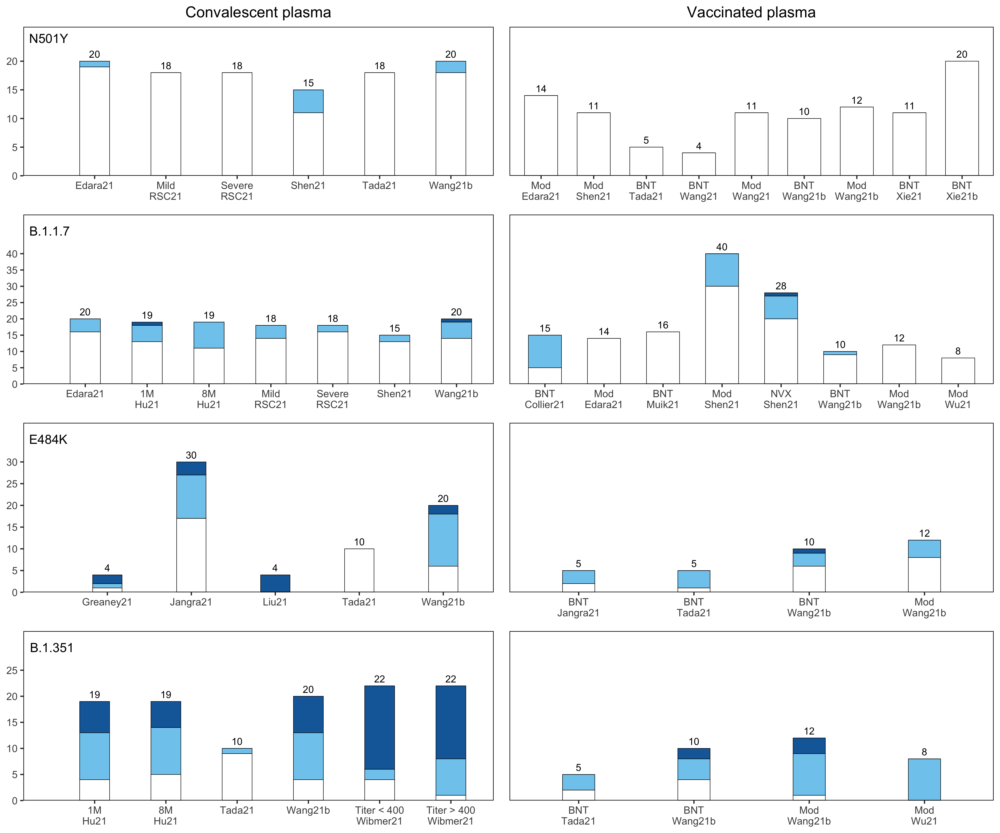
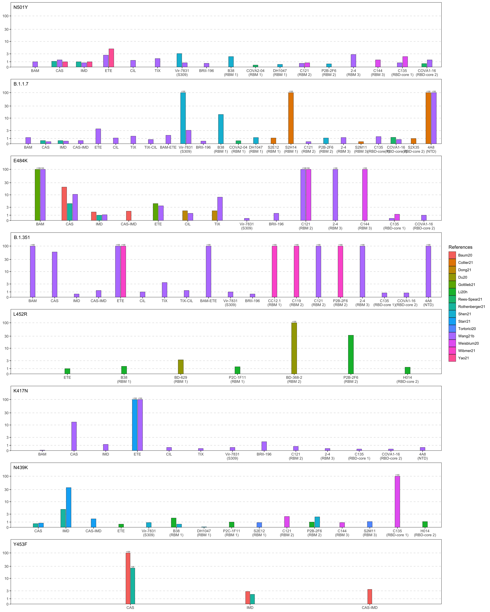

Report generated at: 04/21/2021 08:27 PM PDT

## Statistic Numbers

<table class=" lightable-minimal" style='font-family: "Trebuchet MS", verdana, sans-serif; width: auto !important; margin-left: auto; margin-right: auto;'>
 <thead>
  <tr>
   <th style="text-align:left;"> variant_group </th>
   <th style="text-align:right;"> num.CP </th>
   <th style="text-align:right;"> num.IP </th>
   <th style="text-align:right;"> num.phase3MAb </th>
   <th style="text-align:right;"> num.structuredMAb </th>
   <th style="text-align:right;"> num.otherMAb </th>
  </tr>
 </thead>
<tbody>
  <tr>
   <td style="text-align:left;"> S:501Y </td>
   <td style="text-align:right;"> 148 </td>
   <td style="text-align:right;"> 109 </td>
   <td style="text-align:right;"> 52 </td>
   <td style="text-align:right;"> 17 </td>
   <td style="text-align:right;"> 64 </td>
  </tr>
  <tr>
   <td style="text-align:left;"> S:484K </td>
   <td style="text-align:right;"> 93 </td>
   <td style="text-align:right;"> 66 </td>
   <td style="text-align:right;"> 58 </td>
   <td style="text-align:right;"> 15 </td>
   <td style="text-align:right;"> 63 </td>
  </tr>
  <tr>
   <td style="text-align:left;"> Other mutations </td>
   <td style="text-align:right;"> 713 </td>
   <td style="text-align:right;"> 537 </td>
   <td style="text-align:right;"> 741 </td>
   <td style="text-align:right;"> 424 </td>
   <td style="text-align:right;"> 1391 </td>
  </tr>
  <tr>
   <td style="text-align:left;"> B.1.1.7 Spike </td>
   <td style="text-align:right;"> 477 </td>
   <td style="text-align:right;"> 583 </td>
   <td style="text-align:right;"> 69 </td>
   <td style="text-align:right;"> 29 </td>
   <td style="text-align:right;"> 125 </td>
  </tr>
  <tr>
   <td style="text-align:left;"> B.1.351 Spike </td>
   <td style="text-align:right;"> 432 </td>
   <td style="text-align:right;"> 409 </td>
   <td style="text-align:right;"> 63 </td>
   <td style="text-align:right;"> 18 </td>
   <td style="text-align:right;"> 55 </td>
  </tr>
  <tr>
   <td style="text-align:left;"> P.1 Spike </td>
   <td style="text-align:right;"> 115 </td>
   <td style="text-align:right;"> 123 </td>
   <td style="text-align:right;"> 28 </td>
   <td style="text-align:right;"> 4 </td>
   <td style="text-align:right;"> 20 </td>
  </tr>
  <tr>
   <td style="text-align:left;"> Other mutation combinations </td>
   <td style="text-align:right;"> 641 </td>
   <td style="text-align:right;"> 536 </td>
   <td style="text-align:right;"> 184 </td>
   <td style="text-align:right;"> 119 </td>
   <td style="text-align:right;"> 423 </td>
  </tr>
</tbody>
</table>

### Unique MAbs

<table class=" lightable-minimal" style='font-family: "Trebuchet MS", verdana, sans-serif; width: auto !important; margin-left: auto; margin-right: auto;'>
 <thead>
  <tr>
   <th style="text-align:left;"> has_structure </th>
   <th style="text-align:right;"> count </th>
  </tr>
 </thead>
<tbody>
  <tr>
   <td style="text-align:left;"> Yes </td>
   <td style="text-align:right;"> 37 </td>
  </tr>
  <tr>
   <td style="text-align:left;"> No </td>
   <td style="text-align:right;"> 170 </td>
  </tr>
</tbody>
</table>

## Convalescent and immune plasma

fold ↓ susceptibility > 10&nbsp;
fold ↓ susceptibility 3 to 10&nbsp;
fold ↓ susceptibility < 3

## Monoclonal antibodies

